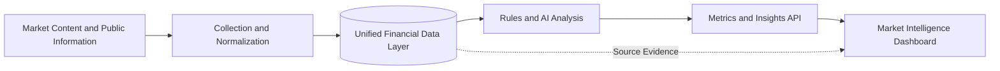

# Financial Market Monitor

> An AI-assisted market intelligence and sentiment observability platform for securities and asset management.


Financial Market Monitor, also known as Futu Radar, transforms fragmented market conversations, institutional content, and investor opinions into structured and traceable market intelligence. It helps research, product, and marketing teams monitor attention, sentiment, and narrative shifts across ETFs and related assets.

The platform connects data collection, semantic analysis, metric computation, and interactive visualization in one workflow. Deterministic rules handle instrument identification and financial metrics, while AI extracts meaning from unstructured text. The resulting signals are delivered through a unified API and a market-focused dashboard.

## Why It Matters

- **Finance-native context** — Data is organized around tickers, product relationships, issuers, and market themes to reduce ambiguity in financial language.
- **Signals over noise** — Cleaning, deduplication, relevance screening, and sample-quality controls turn large volumes of discussion into observable market signals.
- **Facts and opinions stay separate** — Deterministic logic computes quantitative metrics; AI interprets sentiment, topics, and narratives without rewriting source facts.
- **Traceable insights** — Aggregated findings can be traced back to their evidence, analysis version, time range, and processing state.
- **Built for continuous operation** — Incremental processing, scheduled jobs, failure recovery, and multi-environment deployment support long-running research workflows.

## Architecture



Facts, model judgments, and presentation logic are managed as separate layers. The backend owns financial metric definitions, data workers handle synchronization and analysis, and the frontend consumes standardized results. This keeps calculations consistent across every view.

## Technology Stack

| Layer | Technologies |
| --- | --- |
| Web application | React, Vite, React Router |
| API services | Python, Flask, Gunicorn |
| Data processing | SQLAlchemy, Pandas, scheduled jobs, incremental ETL |
| Intelligent analysis | Structured prompts, typed outputs, rules and LLM orchestration |
| Data storage | MySQL 8, SQLite, Alembic |
| Quality and delivery | Pytest, Node Test Runner, Playwright, Docker |

## Quick Start

Requirements: Node.js 18+ and Python 3.11. Full data mode uses MySQL 8; SQLite is supported for local development.

```bash
git clone https://github.com/NIKI678531/futu_rader.git
cd futu_rader
```

Start the API:

```bash
cd backend
python -m venv .venv
# Activate the virtual environment for your shell, then:
python -m pip install -r requirements.txt
python app.py
```

Start the web application:

```bash
cd frontend
npm install
npm run dev
```

Open `http://localhost:5173` in a browser. The API runs on `http://localhost:8008` by default. Configuration examples are available in `backend/.env.example` and `worker/.env.example`.

To start the containerized infrastructure:

```bash
docker compose up -d
```

## Project Structure

```text
frontend/   Market intelligence dashboard and user experience
backend/    Financial metrics, query services, and unified API
worker/     Data synchronization, ETL, AI analysis, and scheduling
radar_db/   Data models, migrations, and shared access layer
deploy/     Airflow and Kubernetes deployment resources
docs/       Metric definitions, architecture decisions, and operations guides
```

## Quality Principles

The platform treats “no data” and “a measured value of zero” as different states. Source coverage, analysis progress, and sample quality are part of every result. Core financial metrics have a single calculation source, while AI outputs use structured constraints and versioned analysis so that each conclusion can be explained by its data, rules, and execution context.

## Use Cases

Financial Market Monitor supports ETF product research, market sentiment observation, brand and competitor monitoring, investor-relations analysis, and trend discovery for financial content teams. It provides market observation and research support; it does not constitute investment advice, a trading signal, or a promise of returns.
