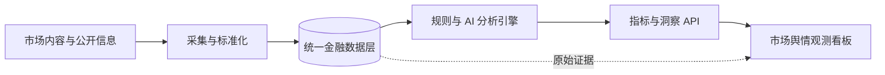

# Futu Radar

> 面向证券与资产管理场景的金融市场舆情观测与智能分析平台


Futu Radar 将分散的市场讨论、机构内容与投资者观点转化为结构化、可追溯的金融舆情信号，帮助研究、产品与市场团队持续观察 ETF 及相关资产的关注度、市场态度和叙事变化。

项目围绕“数据采集—语义分析—指标计算—可视化决策”构建完整链路。规则引擎负责金融产品识别和统计口径，AI 分析负责从非结构化文本中提取语义信号，最终通过统一 API 和交互式看板呈现市场状态。

## 项目价值

- **金融语境优先**：围绕证券代码、产品关系、发行商和市场主题组织数据，降低通用文本分析在金融场景中的歧义。
- **信号而非噪声**：通过数据清洗、内容去重、相关性判断和样本质量控制，将海量讨论压缩为可观察的市场信号。
- **事实与观点分层**：统计指标由确定性规则计算，AI 用于理解态度、主题和叙事，避免生成内容改写客观数据。
- **结果可追溯**：从聚合指标回到原始证据，保留分析版本、数据范围和处理状态，便于复核与审计。
- **面向持续运行**：支持增量数据处理、任务调度、失败恢复和多环境部署，可作为金融研究工作流的长期数据基础设施。

## 系统架构



系统将事实数据、模型判断和展示逻辑分层管理。后端集中维护金融指标口径，数据任务负责同步和分析，前端只消费标准化结果，从而保证不同视图中的指标一致。

## 技术栈

| 层级 | 技术 |
| --- | --- |
| Web 应用 | React、Vite、React Router |
| API 服务 | Python、Flask、Gunicorn |
| 数据处理 | SQLAlchemy、Pandas、定时任务与增量 ETL |
| 智能分析 | 结构化提示词、类型化输出、规则与大模型协同 |
| 数据存储 | MySQL 8、SQLite、Alembic |
| 工程保障 | Pytest、Node Test Runner、Playwright、Docker |

## 快速开始

环境要求：Node.js 18+、Python 3.11。完整数据模式需要 MySQL 8，也可在本地使用 SQLite。

```bash
git clone https://github.com/NIKI678531/futu_rader.git
cd futu_rader
```

启动 API：

```bash
cd backend
python -m venv .venv
# 激活虚拟环境后
python -m pip install -r requirements.txt
python app.py
```

启动 Web 应用：

```bash
cd frontend
npm install
npm run dev
```

浏览器访问 `http://localhost:5173`，API 默认运行在 `http://localhost:8008`。环境配置示例见 `backend/.env.example` 与 `worker/.env.example`。

需要容器化基础设施时可运行：

```bash
docker compose up -d
```

## 工程结构

```text
frontend/   金融舆情看板与交互体验
backend/    指标计算、查询服务与统一 API
worker/     数据同步、ETL、AI 分析与任务调度
radar_db/   数据模型、迁移与共享访问层
deploy/     Airflow 与 Kubernetes 部署资源
docs/       产品口径、架构决策与运行文档
```

## 质量原则

项目对“没有数据”和“数据为零”进行严格区分，并将来源覆盖、分析进度和样本状态作为结果的一部分。所有核心金融指标保持单一计算来源，AI 输出采用结构化约束和版本管理，确保系统能够解释一个结论来自什么数据、什么规则以及哪次分析。

## 适用场景

Futu Radar 可用于 ETF 产品研究、市场情绪观察、品牌与竞品监测、投资者关系分析，以及金融内容运营中的趋势发现。它提供的是市场信息观测与研究支持，不构成投资建议、交易信号或收益承诺。
