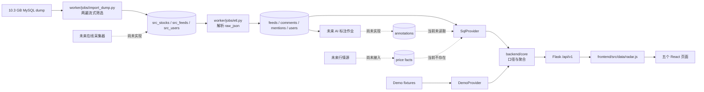
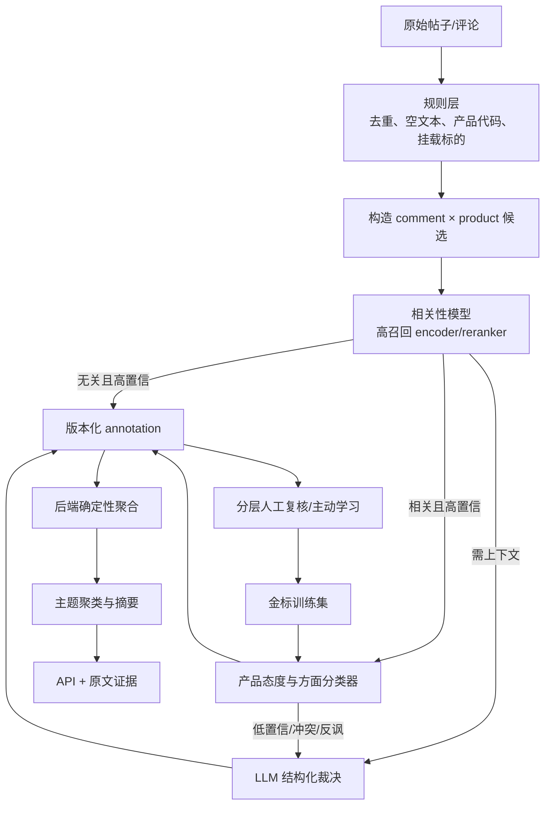

# 舆情雷达架构、真实数据链路与 AI 分析需求审计

> 审计日期：2026-09-10  
> 审计对象：当前工作树中的前端、Flask API、SQL provider、SQLite 瘦库、worker、PRD 与 ADR。  
> 结论基于实际代码、真实 SQLite 只读统计、Flask 测试客户端和五个页面的浏览器验证。

## 1. 结论

项目并不是“没有真实数据”。本机已经有一份约 5.27 GB 的真实 SQLite 瘦库，包含 504,400 篇帖子、350,399 条解析评论、927,071 条帖子—标的提及和 18,292 个用户。真实数据截至 2026-08-26 03:00，最近一个完整自然日锚点是 2026-08-25。

目前页面没有呈现这些数据，原因是四条链路同时没有闭环：

1. 本地后端默认选择 `demo` provider；必须显式设置 `DATA_PROVIDER=sql` 才会读真实库。
2. `sql` provider 虽能返回真实计数，但 12 个依赖 AI 或行情的查询仍固定返回 `None`，`annotations` 表也是空的。
3. 前端没有按接口约定处理这些 `null / unavailable`。在真实 provider 下，五个页面都会在渲染阶段抛异常，随后被错误边界误报为“后端服务连不上”。
4. worker 只有 heartbeat。在线采集、AI 标注、行情接入、MySQL 首次建表与灌数都没有自动化；`docker compose up` 会得到一个空 MySQL。

因此正确顺序是：先让真实统计在缺少 AI 时也能稳定展示，再补标注数据模型和离线标注作业，最后通过统一金标集选择模型。直接接一个大模型无法解决当前的前端契约错误、数据库写入缺口或行情缺失。

## 2. 当前架构

职责边界本身是合理的：

- `worker/` 只写原始事实和模型推断，不计算热度、环比、排名等业务口径。
- `backend/core/` 是口径的唯一实现处。
- `providers/demo.py` 用确定性 fixture 保证设计验收，`providers/sql.py` 读取真实 SQLite/MySQL。
- `frontend/src/data/radar.js` 是屏幕唯一数据门面。

主要问题不在分层，而在各层之间尚未形成一个可运行的真实数据契约。

## 3. 真实数据写入方式

### 3.1 一次性 dump 导入

入口是 [`worker/jobs/import_dump.py`](../worker/jobs/import_dump.py)。它执行两遍流式扫描：

1. 第一遍读取股票与用户，建立 `ticker → stock_id` 映射，并验证客户维护的 120 只产品全部命中。
2. 第二遍读取帖子，按产品池和时间窗过滤，分批写入 `src_feeds`。
3. 导入结束后把 `anchor`、`data_max_ts`、窗口起点、扫描行数和导入行数写入 `meta_kv`。

默认数据库由 [`radar_db/__init__.py`](../radar_db/__init__.py) 决定：Windows 下为 `%LOCALAPPDATA%\futu-radar\radar.db`；设置 `RADAR_DB_URL` 后可改为 MySQL。

### 3.2 `raw_json` ETL

入口是 [`worker/jobs/etl.py`](../worker/jobs/etl.py)。它把镜像层拆成四张扁平事实表：

| 表 | 内容 | 后续用途 |
|---|---|---|
| `feeds` | 帖子正文、作者、发布时间、赞评转、浏览、截断标记 | 帖子列表、热度、账号域分析 |
| `comments` | 评论正文、作者、时间、点赞、回复关系 | 产品相关性、产品态度、主题、证据 |
| `mentions` | `feed_id × code × source`，source 为挂载或正文 | 产品归属、阵营、产品候选集 |
| `users` | 昵称、粉丝、地区、简介等原始资料 | 身份映射；不能发送给外部模型 |

ETL 会先删除现有事实表，再以 2,000 行一批提交新数据。这个方式适合一次性重建，不适合持续生产写入：任务中断时可能留下半成品库，也没有 staging 表、批次状态或原子切换。

### 3.3 持续写入路径

- [`worker/jobs/refresh.py`](../worker/jobs/refresh.py) 是 Airflow 使用的稳定入口；
  `FutuRefresh` 从 MarketInsight MySQL 只读增量拉取，再幂等写入 Radar。
- [`worker/jobs/collect.py`](../worker/jobs/collect.py) 保留为兼容入口，并转发到同一同步实现。
- 三条 keyset 流分别跟踪新帖子、详情正文和用户资料；固定 high-watermark 后逐页提交，
  每页事实和 checkpoint 在同一个目标库事务中。
- 在线同步不会清空事实表。评论快照为 partial 时只 upsert 已见评论，不删除历史评论。
- [`worker/scheduler.py`](../worker/scheduler.py) 仍只负责本地 heartbeat；生产调度唯一来源是 Airflow。
- 没有价格事实源时，K 线和日线价格仍不能由社区数据推出。
- compose 的 [`init_db.sql`](../init_db.sql) 只建库和授权；生产 schema 必须显式执行 Alembic。

### 3.4 写入层仍需部署侧完成的事项

1. 在目标 MySQL 8 执行 Alembic，并用流式迁移工具复制现有 SQLite 历史。
2. 为 MarketInsight 创建只读账号，为 Radar 创建最小写入权限账号，并通过 Secret 注入。
3. 执行 MySQL 集成、Dataset 触发、告警与恢复演练后再切换 Flask/worker。
4. 将行情作为独立事实源接入，不用模型或其他产品价格填补。

完整上线步骤见 [`automatic-collection.md`](automatic-collection.md)。

## 4. 已有真实数据与可用程度

本次只读检查得到：

| 项目 | 实测值 |
|---|---:|
| SQLite 文件 | 5,267,922,944 bytes |
| 帖子 | 504,400 |
| 评论 | 350,399 |
| 提及关系 | 927,071 |
| 用户 | 18,292 |
| AI annotations | 0 |
| 空评论正文 | 1,239（0.35%） |
| 评论平均长度 | 13.5 字符 |
| 帖子损坏 JSON | 167（0.033%） |
| 带图片帖子 | 47,425 |
| 被标记评论分页截断的帖子 | 11,374 |
| 近 30 日解析评论 | 97,445 |
| 近 30 日评论—产品判定单元 | 98,508 |

最近 7 日的 SQL 结果也不是空的：全池共有 30,615 次提及和 23,320 条平台评论计数；官号与 KOL 各返回 29 篇帖子，识别到 9 位活跃 KOL。120 只产品中 116 只可计算完整热度，4 只因至少一篇源 JSON 损坏、转发数未知而按当前“未知传染”规则无法计算完整热度。

这说明当前最先应该验证和上线的是计数、内容、时间桶、排名与账号帖子，而不是等待所有 AI 字段完成后才展示任何真实内容。

## 5. 为什么五个页面在真实模式下都失败

本次以 `DATA_PROVIDER=sql` 启动 Flask，并用浏览器访问五个路由。后端请求均返回 200，但页面随后进入错误边界。

| 页面 | 首个可复现错误 | 根因 |
|---|---|---|
| 板块总览 | `Cannot read properties of null (reading 'positive')` | [`sectorOverview/index.jsx`](../frontend/src/screens/sectorOverview/index.jsx) 直接读取 `o.attitude.positive`，而 SQL provider 明确返回 `attitude: None`。 |
| 产品监控 | 同上 | [`productMonitor/index.jsx`](../frontend/src/screens/productMonitor/index.jsx) 直接读取 `o.attitude`。 |
| KOL 影响力 | `Cannot read properties of undefined (reading 'group')` | 帖子 `postType` 尚未标注，页面仍按已识别类型访问映射。 |
| KOL 详情 | `Cannot read properties of null (reading 'length')` | `kolOpinions()` 返回 `None`，页面直接读取 `opRows.length`；类型画像也依赖尚未生成的 `typeCounts`。 |
| 官号动态 | `em.own.map is not a function` | demo 契约中的 `own/peer` 是数组，SQL provider 返回数字，且缺少 `total/postCount`，属于独立的 provider 契约错误。 |

此外：

- [`frontend/src/lib/api.js`](../frontend/src/lib/api.js) 定义了 `readStatus()`，但没有任何调用方；端点信封里的 `unavailable` 状态实际上被屏幕丢弃。
- [`frontend/src/components/ScreenBoundary.jsx`](../frontend/src/components/ScreenBoundary.jsx) 把所有 React 渲染异常都显示成“后端服务连不上”，所以真实原因被隐藏。
- 三个账号页面仍硬编码“演示数据”，产品趋势与阶段说明也仍写“演示数据”。即使真实数据成功渲染，界面也会继续误标。
- 本地 [`backend/.env.example`](../backend/.env.example) 的默认 provider 是 `demo`，仓库中没有 `backend/.env`。前端只知道 8008 地址，不知道该进程实际使用哪个 provider。

把 demo 与 SQL provider 的返回形状递归比较后还发现：`benchmark.base` 在 demo 中是完整产品观测，SQL 只给少量计数字段；`dailyFor` 的 demo 长度为 42 天，SQL 为 60 天；SQL 的 KOL leader 缺少 `posts`，并把多个画像字段设为 `null`。这些差异未必都会成为第一个报错，但会在修完当前首错后继续暴露，应该用同一份 schema/contract test 一次性收敛。

当前测试覆盖了 API fixture 和 SQL provider 的函数行为，且本次运行结果为 backend 442 项、worker 26 项全部通过。但没有一条浏览器测试以 SQL provider 和缺失 AI 字段跑完五个页面，所以“单元测试全绿、真实模式全页崩溃”可以同时发生。

## 6. AI 分析需求：先定义任务，再选模型

模型的基本判定单元应是 `(内容 ID, 产品代码)`，不能只给一条评论一个全局情绪。一句比较评论可能对产品 A 积极、对产品 B 消极。现有 `annotations` 没有产品维度，无法表达这种结果。

### 6.1 原子任务

| 任务 | 输入单元 | 建议标签/输出 | 主要消费者 | 合适技术 |
|---|---|---|---|---|
| 文本可用性与噪声 | 评论或帖子 | `valid / empty / emoji_only / spam / duplicate` | 全部 AI 下游、样本覆盖率 | 规则、指纹、轻量分类器 |
| 产品实体与指代 | 评论＋帖子上下文 | 产品代码集合、证据跨度、是否需要上下文 | 评论—产品判定单元 | 结构化上游字段＋词典；疑难再用 NER/LLM |
| 产品相关性 | 评论×产品 | `relevant / irrelevant / needs_context` | 态度分母、证据、主题 | encoder 分类器或 reranker；高召回优先 |
| 产品态度 | 相关评论×产品 | `positive / neutral / negative / mixed / ambiguous`，聚合时后三种需按规则处理 | 板块 S7–S10、产品 P6/P7/P9/P11 | 监督分类器；疑难升级 LLM |
| 产品方面 | 相关评论×产品 | 费用、流动性、跟踪、溢折价、结构/杠反损耗、分红、交易体验、发行商服务、其他 | 观点主题、负面类别、竞品比较 | 多标签分类器＋embedding 聚类 |
| 市场话题情绪 | 评论×产品 | 市场方向/指数/宏观/事件主题及极性 | 产品 P13 | 分类器＋聚类；与产品态度严格分开 |
| 帖子内容形式 | 帖子 | PRD 的 8 类，必选一类 | KOL/官号筛选、画像、CSV | 多分类器或小型 LLM |
| 操作方向 | 帖子 | 加仓/减仓/建仓/清仓/持有观望/无明确操作/待确认 | KOL 两页、官号 | 规则＋分类器；歧义升级 LLM |
| 摘要与依据句 | 帖子或产品时间窗 | 帖子摘要 ≤60 字、热议摘要 ≤30 字、产品/阶段摘要；原文证据 ID 与跨度 | 总览、产品、KOL、官号 | 生成式 LLM，严格结构化输出与引用校验 |
| 观点主题 | 相关评论集合 | 主题簇、极性、样本、首末时间、代表证据 | S10、P9、P12、P13 | embedding 聚类＋LLM 命名/归纳 |
| 动态负面类别 | 消极产品评论集合 | 3–6 类、生命周期、严重度、证据 | S7/S10、P9 | 多标签分类＋时间聚合＋LLM 命名 |
| 合规关注信号 | 评论/帖子×自家产品 | 5 类风险信号、依据跨度、`ai_pending` | S7/S8/S10、P10 | 高召回分类/规则＋LLM 解释＋人工确认 |
| 竞品候选关系 | 产品对＋比较内容 | `confirmed / auto_candidate`、理由、证据 | P14、总览抽屉 | 固定映射优先；embedding/共现/LLM 只产候选 |

`camp`、帖子挂载标的、正文结构化提及、评论量、热度、排名、环比、KOL/官号名单都不是模型任务。价格也不是模型任务。把这些交给 LLM 会增加成本并降低可重复性。

### 6.2 页面依赖

| 页面 | 不等模型即可真实展示 | 需要 AI 后才完整 |
|---|---|---|
| 板块总览 | 产品池、评论量、赞转、热度、活跃账号、全市场排名、环比 | 态度、热议总结、主题、负面类别、合规关注、自动竞品候选 |
| 产品监控 | 产品主数据、数量 KPI、热度/活跃趋势、固定竞品映射 | 产品总结、态度、观点主题、话题情绪、KOL 代表摘录、合规、阶段观点 |
| KOL 影响力 | KOL 帖子、提及产品、阵营、互动量、声量排名 | 帖子类型、操作方向、摘要、类型画像 |
| KOL 详情 | 帖子与时间线、阵营/互动统计 | 风格画像、类型构成、其他产品观点与操作 |
| 官号动态 | 官号帖子、ETF 提及、阵营、互动量 | 帖子类型、操作方向、摘要、依据句 |

第一批 AI 上线应优先完成“评论相关性＋产品态度”和“帖子类型＋方向＋摘要”。它们能解锁最多核心模块。主题、阶段、合规和竞品候选建立在这些原子标签之上，不应先让 LLM直接生成整页汇总。

## 7. 推荐的混合模型架构

各模型只做自己擅长的工作：

- 规则层处理确定性字段、精确去重、格式和已结构化产品提及。
- embedding 用于近重复、候选召回和主题聚类；相似度本身不能当态度。
- reranker/encoder 负责高吞吐相关性与态度分类，使用项目金标微调和校准。
- LLM 负责需要上下文的难例、结构化摘要、主题命名、风险依据解释和教师弱标注。
- 人工标注是最终真值，尤其是合规信号；LLM 生成的伪标签只能作为经抽检的训练扩充。

具体候选模型、公开数据集、许可证和一手来源见 [模型与数据集调研](research/sentiment-models-and-datasets.md)。已有的两份探索记录 [sentiment-model-selection.md](research/sentiment-model-selection.md) 与 [better-nlp-models.md](research/better-nlp-models.md) 可作为实验假设，最终选型仍须在同一项目金标集上比较。

## 8. 标注数据模型需要先升级

当前 `annotations` 只有 `target_type / target_id / kind / value / confidence / model / created_at`，有四个阻塞：

1. 没有 `subject_code`，不能表达一条评论对不同 ETF 的不同态度。
2. 没有唯一约束、任务状态或重跑版本，重复任务会产生多条互相冲突的“最新结果”。
3. 没有 prompt、taxonomy、模型 revision、输入 hash、证据跨度和人工复核字段，不能审计或判断旧标注是否失效。
4. `id` 是 `BigInteger autoincrement`；SQLite 只有精确的 `INTEGER PRIMARY KEY` 才自动分配 rowid。本次内存 SQLite 实测，不显式提供 `id` 会报 `NOT NULL constraint failed: annotations.id`。

建议至少拆为：

| 表 | 关键字段 |
|---|---|
| `annotation_runs` | `run_id, task, model_provider, model_id, model_revision, prompt_version, taxonomy_version, started_at, finished_at, status, input_count, success_count, error_count` |
| `annotations` | `target_type, target_id, subject_code, kind, value_json, calibrated_confidence, run_id, input_hash, created_at`；对当前生效版本建立唯一键 |
| `annotation_evidence` | `annotation_id, source_target_type, source_target_id, start_offset, end_offset, quote_hash` |
| `review_decisions` | `annotation_id, reviewer, decision, corrected_value_json, reason_code, reviewed_at` |

另设任务队列或 job state，支持 claim、重试、指数退避、死信和幂等提交。不要用 `created_at` 猜哪条结果有效。

## 9. 人工标注、训练与评测

### 9.1 金标集

第一轮建议约 3,000 个评论—产品样本和 1,000 篇帖子，采用双人独立标注、冲突仲裁。抽样一半反映真实分布，另一半覆盖繁简混合、粤语、英文缩写、短句、表情、否定、反讽、比较、多产品、纯市场涨跌、回复指代、热门截断帖和图片帖。

切分必须按帖子线程分组并按时间留出最终测试窗；同一线程或近重复文本不能跨 train/test。另保留产品外推切片，观察模型对低频 ETF、新代码和新品的泛化。

公开人工标注数据可用于语言适配和 warm start，但不能替代项目金标。通用微博/电商“正负面”通常没有本项目最关键的边界：产品态度、市场方向和无关内容三者分离。公开数据的商用许可、衍生模型许可和原始平台条款必须逐项核实。

### 9.2 指标

| 层 | 必看指标 |
|---|---|
| 相关性 | relevant recall、irrelevant precision、needs-context 占比 |
| 产品态度 | macro-F1、每类 precision/recall、负面召回、mixed/ambiguous 去向 |
| 校准 | reliability curve、ECE/Brier、coverage-accuracy；LLM 自报 confidence 不能直接当概率 |
| 聚合 | 产品级正负比例误差、排名稳定性、时间桶趋势偏差 |
| 主题/摘要 | 证据覆盖率、无依据陈述率、重复主题率、人工成对偏好 |
| 合规信号 | 各风险类召回与误报率、人工确认率；所有输出保持 `ai_pending` |
| 工程 | schema 成功率、重试率、吞吐、p50/p95、每万条“正确自动通过”的总成本 |
| 漂移 | 语言、产品、板块、文本长度、时间、热点事件和数据源版本切片 |

模型放行阈值必须由这套金标校准。`lowConfidence=0.7` 目前只是产品配置，不是已经验证的正确率阈值。

> **2026-09-11 更新（[ADR-0019](adr/0019-ai-auto-publish-no-human-gate.md)）**：项目负责人裁决
> **不做金标、不做复核、不做抽检、不设放行阈值** —— 本节的评测口径保留为将来要补的功课，
> 但它**不再是上线前置条件**。当前 `calibrated_confidence` 全为 NULL，`lowConfidence=0.7`
> 在校准概率存在之前**不生效**；「待确认」徽章的唯一触发是 `review_state = 'needs_review'`
> （模型自己举手），与阈值无关。

## 10. 实施顺序

### P0：让真实数据可见

1. 新增明确的运行配置与 provider 标识；SQL 模式在库缺失时启动失败，并在 `/meta` 返回 provider、schema version、data freshness。
2. 修复 `etfMentionsFor` 的 SQL 返回形状，使其与 demo 和前端完全一致。
3. 为所有 `unavailable` 响应定义 shape-stable 契约；前端按 endpoint/field status 渲染局部“暂不可用”，不允许整页崩溃。
4. 错误边界区分网络错误、HTTP 错误和渲染错误。
5. 新增“SQL provider + 无 annotations”的五页浏览器 smoke test。这一关通过前，不开始全量模型调用。

验收：五页都能打开；真实计数可见；AI/行情区域显示准确的缺失原因；页面不再出现“演示数据”；数据库统计与 API 抽查一致。

### P1：建立可评测的 AI 最小闭环

1. 冻结相关性、产品态度、帖子类型、操作方向和风险标签指南。
2. 迁移 annotation schema，修复 SQLite 自增，加入 subject、版本、证据和复核字段。
3. 建立金标集与模型无关的离线 benchmark harness。
4. 用规则/线性模型、轻量 encoder/reranker、托管 LLM 跑同一隐藏测试集。
5. 实现可恢复、幂等的批量 annotation job；先影子写入，不影响页面。
6. `SqlProvider` 读取**现行**标注（[ADR-0019](adr/0019-ai-auto-publish-no-human-gate.md)：链末且非
   `rejected`，不再按版本／阈值放行），后端聚合为 attitude、帖子三件套和证据。

验收：可按 run/model/taxonomy 追溯每条结论；同一批数据可重跑；重跑不覆盖人工改过的结论
（`approved`／`corrected` 由 `annotate.py` 的 `_HUMAN_SETTLED` 跳过）；P0 页面逐步从“暂不可用”
变为真实 AI 输出，且页面如实标明这些结论**未经人工验证**。

### P2：高级分析与持续运行

1. 用已复核标签微调/蒸馏本地模型，以主动学习优先补难例和漂移样本。
2. 基于评论级原子标签生成主题、负面生命周期、阶段观点和时间窗摘要。
3. 接行情事实源并对齐交易日/时间桶。
4. 实现授权后的增量采集、数据质量监控、重放和 MySQL 部署流水线。
5. 对外部模型增加脱敏、区域/留存策略、费用预算和熔断降级。

## 11. 需要产品确认的事项

1. PRD §7 写“评论区内容层分析下线”，但 §3.4、§4.1、§4.2 又把评论级态度、主题和证据作为市场域核心。建议明确为“账号域评论分析下线，市场域保留”；否则核心态度功能本身没有合法输入。
2. 产品态度里的 `mixed/ambiguous/needs_context` 如何进入最终三分类分母，必须在训练前冻结。
3. AI 摘要输出简体、繁体或随原文语言，仍是开放项。
4. 五类合规信号的人工确认责任人、SLA 和结果展示方式尚未定义。
5. 是否允许把去标识后的评论正文发送到外部模型，以及允许的服务区域、留存和训练使用条款。
6. KOL/官号当前按名称匹配，客户名单与真实账号只能命中一部分；需要正式 UID 映射。
7. 行情供应商与许可尚未确定；它独立于 AI 选型。

## 12. 本次验证记录

- Backend：442 tests passed。
- Worker：26 tests passed。
- SQL API：22 个路由均可响应；10 个至少部分返回真实数据，12 个因 AI/行情未实现而为 `unavailable`。
- 浏览器：`/sector`、`/product`、`/kol`、`/kol/detail`、`/official` 在 SQL 模式下均复现渲染错误。
- SQLite annotation 自增：不提供 `id` 的 insert 复现 `NOT NULL constraint failed: annotations.id`。

测试通过只证明当前被测试的行为成立；其中 SQL provider 测试明确把 AI/行情函数固定返回 `None` 当作预期，因此不能代表真实数据页面已经可用。
