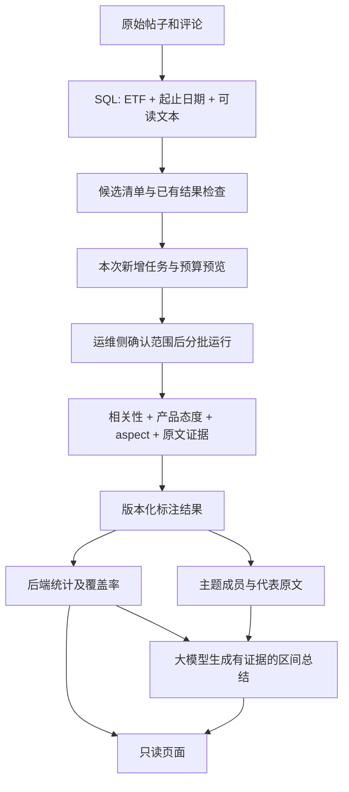

# 按 ETF 与日期筛选的舆情 AI 分析：调研与实施计划

> 调研日期：2026-09-11。
> 性质：方案建议，不代表已实施；不授权外发真实数据、付费调用、下载模型或改动业务代码。
> 读者：先看第 1、2 节理解方向，再看项目与学习资源，最后按实施阶段推进。
> 依据：当前代码、同会话的只读运行核查、官方仓库/模型卡/课程。访问与验证限制见第 10 节。

## 1. 大白话结论

不需要把 35 万条评论全部发给大模型。应先由数据库筛出指定 ETF、指定日期的候选评论，跳过已有可复用结果，再让 AI 分批判断相关性与产品态度。需要总结时，把这一范围的统计事实和有代表性的原文交给大模型。

推荐顺序：**筛选和复用先落地，现有 GPT 跑通一个小范围，随后加主题归纳，最后再考虑用小模型降低长期成本。**

小模型不是安装后就天然懂“富途 ETF 产品态度”。尤其要区分：

| 技术 | 大白话 | 能做什么 | 不能替代什么 |
|---|---|---|---|
| SQL 筛选 | 查指定的产品和日期 | 排除范围外内容、不花模型费 | 不能判断反讽或正负面 |
| 情感分类器 | 给每条内容贴态度标签 | 正面、负面、中性 | 普通金融语气不等于针对某只 ETF 的态度 |
| 目标级态度分析 | 判断“在说谁的什么问题” | 同一句分别评价不同 ETF | 不能用整句一个标签覆盖所有产品 |
| 向量模型 | 把意思相近的内容放近 | 相似内容检索、主题候选 | 相似度不是情感，不是准确率 |
| 主题聚类 | 把讨论归成若干话题 | 费用、跟踪、分红等讨论归组 | 一个主题里的每条评论不一定同一态度 |
| 大语言模型 | 读上下文、解释和写总结 | 复杂分类、主题命名、证据摘要 | 不能凭阅读印象计算全量占比 |

### 1.1 延续现有项目约束

- 按 [PRD](../PRD.md) 区分产品态度与市场方向：“指数要涨”不是产品正面，“跟踪误差大”才是产品属性评价。
- 按 [ADR-0019](../adr/0019-ai-auto-publish-no-human-gate.md) 自动展示非 rejected 的现行结论，不新增人工审批、人工抽检或双模型一致性发布门槛。
- 无人工金标时，真实业务准确率未知；模型之间的一致率、输出格式通过率都不能冒充准确率。
- `calibrated_confidence` 没有校准依据就继续为 NULL。模型自报存疑可以标“待确认”，不是要求先由人审批。
- 网站保持只读。分析任务通过运维侧 CLI/调度触发，不在现有五页擅自加“分析”“审批”“推送”按钮。
- 统计公式及口径只在后端 core 实现，worker 负责模型输出、任务与证据持久化；不修改只读设计镜像。

## 2. 当前项目实际差在哪

同一会话此前的只读核查：504,400 篇帖子、350,399 条评论；129 次评论任务执行包含重跑；40 条现行态度结果覆盖 5 个产品；帖子摘要 0 条。这个快照会随后续任务变化，不是固定数据规模。

| 部分 | 当前事实 | 计划要补的内容 |
|---|---|---|
| 评论排队 | [worker/jobs/annotate.py](../../worker/jobs/annotate.py) 已按 ETF 筛选；内部有 since 参数 | 起止日期、预览、稳定候选集合、可续跑的批次边界 |
| CLI | 有 enqueue/run/status/codes/limit/max-items；没有起止日期参数 | 清晰区分预览、排队和付费运行；新参数不得写成已可用命令 |
| 避免重复 | 输入和版本 hash 加唯一键 | 先跳过已存在任务，再限制本次新增数，避免每次只取到相同的前 N 条 |
| 领取任务 | 当前运行按 task 领取，不是按用户这次选定的批次领取 | 批次成员与领取隔离，防止处理到队列里别的 ETF/日期 |
| 单篇摘要 | 已有 post_annotation 任务和 SQL 读取路径 | 为实际官号/KOL 帖子范围排队并运行，不能只按任意帖子 ID 取前 N 篇 |
| 产品总结 | [backend/providers/sql.py](../../backend/providers/sql.py) 的 summary/themes/stages 等仍是缺失占位 | 新建区间级生成、存储、证据与读取链路，单纯多跑分类不会自动补齐 |
| 自动处理 | [worker/scheduler.py](../../worker/scheduler.py) 只有 heartbeat | 预算受控的增量排队、运行、更新摘要 |

**日期限制：** 当前市场域按所属帖子的日期归桶，评论自己的发布时间大量缺失。第一阶段保持相同口径并声明，不擅自混用评论时间；改用评论事件时间需单独决策及回归，否则分析和页面统计会错位。

**手册陷阱：** 只传 task 和 limit 不会启动分析，当前 CLI 需要显式 enqueue 或 run。不要直接照旧手册中的“帖子任务 + limit”示例期待摘要生成。

## 3. 推荐的数据流程

### 3.1 筛选什么，不筛掉什么

1. 先按产品及日期筛选。以现有挂载产品为候选，不要求每条回复都出现 ETF 代码；“这只费率太贵”仍可能有关。
2. 排除没有可分析文本的内容，保留原因和数量；短句、表情、粤语、否定句不因“看起来没信息”就全部删掉。
3. 同一来源 ID 的重复入库按既有口径处理。相同文字出现在不同作者/不同语境，不自动删除或共享态度。
4. 保留父评论、帖子标题和必要上下文；同一句“很好”在不同上下文可能含义相反。
5. 一条评论可以对 A 正面、对 B 负面。判定单元是“评论 × ETF”，不是“整条评论一个全局标签”。
6. 相关性结果分 relevant/irrelevant/needs_context；无关不算中性，缺上下文不伪造确定性结果。

第一阶段可以让一次模型调用同时返回相关性、态度和 aspect，但 schema 要约束：无关时不产生产品态度。没必要为了形式上的“两阶段”让每条评论固定调用两次模型。

### 3.2 三种批次必须区分

- **业务范围**：某些 ETF + 起止日期 + 筛选规则版本，回答“究竟分析了谁”。
- **执行批次**：一次可追踪的工作清单，回答“这次处理哪些记录、花多少”。
- **模型微批**：一次请求里约 20-30 条短评论作为初始实验值，实际还受输入和输出 token 限制；长评论应减批。

以上数量是建议起点，不是实测最优值。重复运行可继续未完成部分；每条模型返回必须用 ID 与目标 ETF 匹配，不能假设返回顺序不变。

### 3.3 不要把“抽样”变成“全量”

减少范围是明确业务边界，例如只研究两只 ETF 的一周。这个范围内若还只取部分评论，结果必须注明部分覆盖，不得冒充整段时间的总体态度。

“取最相关 Top-K”适合找证据，不适合直接估计整体正负面比例。“按主题取几个代表”适合写摘要，不代表簇内所有成员态度都相同。

## 4. 核查过的 GitHub 项目和模型

本节依据调研当日的一手仓库和模型卡，不以 star 数量或作者宣传的准确率代替实测。代码、权重、训练数据和数据采集权限分别审查。

| 项目 | 适合借鉴的部分 | 对当前项目的判断 | 许可边界 |
|---|---|---|---|
| [TrendRadar](https://github.com/sansan0/TrendRadar) | 按兴趣筛选、批量分类、增量去重、时间调度 | 最适合先理解“过滤后再分析”；主要处理热点新闻/RSS，不是 ETF 评论态度引擎 | GPL-3.0；复制集成代码前审查义务；推送功能不在本项目范围 |
| [BettaFish](https://github.com/666ghj/BettaFish) | InsightEngine 数据库检索、情感模型、ReportEngine 报告组织 | 适合看完整舆情系统如何分工；多 Agent 多轮研究不是第一版降本必需品 | LICENSE 为 GPL-2.0，但 README 又写禁止商用，存在条款冲突；只列学习参考，商用先向作者确认，不直接移植 |
| [BERTopic](https://github.com/MaartenGr/BERTopic) | 向量 + 聚类 + 主题关键词 + 代表文本 + topics_over_time | 产品主题、动态负面分类的主要候选；不是正负面分类器 | MIT；嵌入模型另审 |
| [Sentence Transformers](https://github.com/huggingface/sentence-transformers) | 批量向量、相似检索、聚类与 reranker | 向量基础组件；旧 UKPLab 地址当前重定向到 Hugging Face | Apache-2.0；具体权重另审 |
| [FlagEmbedding](https://github.com/FlagOpen/FlagEmbedding) | BGE 中文/多语向量与相关性重排 | 主题聚类和证据检索候选，不必同时部署所有 embedding/reranker 模型 | 代码 MIT，模型许可分别核对 |
| [SetFit](https://github.com/huggingface/setfit) | 用少量标注样本微调句向量分类器 | 后续低成本学生模型候选；需要标签，不是零样本魔法 | Apache-2.0；多语底座和数据另审 |
| [中文 FinBERT 模型卡](https://huggingface.co/yiyanghkust/finbert-tone-chinese) | 已有正/中/负三分类，约 8,000 条私有研报句子训练 | 可作低成本对照；“研报语气”不等于“某 ETF 产品态度”，不直接接入正式指标 | 卡标 Apache-2.0；私有训练集不可完整审计 |
| [Mengzi 金融底座](https://huggingface.co/Langboat/mengzi-bert-base-fin) | 财经语料继续预训练的中文 BERT | 训练专用分类器的底座，不是下载即可使用的情感分类器 | 卡标 Apache-2.0；仍需任务训练数据 |

### 4.1 如何学习，而不是把整个项目搬过来

- TrendRadar：先读“精准内容筛选”“增量监控”“AI 智能筛选新闻”，学候选集合与更新方式，不照搬分数阈值当准确率。
- BettaFish：先看 README 架构图，再看 InsightEngine 和 ReportEngine 的职责分开；“分析百万评论”等为作者描述，本轮没有性能复现，不作为吞吐承诺。
- BERTopic：先读 [算法说明](https://maartengr.github.io/BERTopic/algorithm/algorithm.html)，再读 [时间演变](https://maartengr.github.io/BERTopic/getting_started/topicsovertime/topicsovertime.html)。同一模型下观察时间变化比每天重新聚类后比较编号可靠。
- SetFit：先读 [quickstart](https://huggingface.co/docs/setfit/quickstart)。官方少样本实验不能外推成本项目“每类 8 条就够”。不做人工验证时，GPT 标签只能叫教师伪标签。

### 4.2 近期和后期技术取舍

**近期：** 现有 SQL/任务表 + 现有 OpenAI-compatible GPT Provider + 输入版本缓存 + 逐条证据。先不用新 GPU、不训练模型、不上多 Agent 框架。

**主题阶段：** 一种经过测试的中文/多语 embedding + BERTopic 或更简单的 aspect 内聚类 + 现有 GPT 命名/总结。中文关键词提取还要配置中文分词或合适的字符特征，不能照搬英文示例的空格分词。

**降本阶段：** 中文 FinBERT 先做对照，SetFit/金融 BERT 再做目标感知学生模型。对粤语、繁体、反话、多个 ETF、短回复分别观察表现。没有人工金标时不能宣称学生“通过准确率验收”，替换正式模型需另行确认风险。

**暂不引入：** Kafka/Spark 大数据集群、专门向量数据库、所有评论 × 120 ETF 的两两重排、多 Agent 互相辩论、网页打开即发起付费任务。几十万行本身不足以证明需要这些复杂组件。

## 5. 学习视频与实操资源

不是按热度排序，而是按“代码初学者怎样理解本项目”排序。英文视频可以尝试平台提供的字幕/自动翻译，是否可用以播放器为准；不承诺已有人工中文字幕。下面的学习目标依据课程文字、仓库说明和页面元信息，不是对完整视频逐分钟观看后的评测。

| 顺序 | 资源与入口 | 你要学到什么 | 使用边界与核查方式 |
|---|---|---|---|
| 1 | [Hugging Face: Working with pipelines，YouTube](https://www.youtube.com/watch?v=tiZFewofSLM) | 一段文本如何进入模型，返回正/负标签；多个句子如何一起输入 | 入门；官方课程源文件明确嵌入此 video ID，见下方来源。示例默认英文情感模型，不直接用于中文生产 |
| 2 | [Hugging Face: Behind the pipeline，YouTube](https://www.youtube.com/watch?v=1pedAIvTWXk) | 文本切分、模型计算、标签输出；理解为什么分批不等于把所有评论合成一句 | 入门进阶；官方课程源文件明确嵌入此 video ID。softmax 分数不能当本项目校准准确率 |
| 3 | [微舆 BettaFish 的一次完整运行记录，Bilibili](https://www.bilibili.com/video/BV1TH1WBxEWN/) | 从提出问题、查数据到生成报告的完整流程 | 中文演示；仓库直接推荐，视频页标题已核对，页面显示 31:53。演示不是商业许可或性能评测 |
| 4 | [DeepLearning.AI: Large Language Models with Semantic Search](https://www.deeplearning.ai/short-courses/large-language-models-semantic-search/) | 关键词、向量检索、重排有什么不同，如何给总结找证据 | Jay Alammar / Luis Serrano；课程页列 7 节视频。优先看 Keyword Search、Embeddings、ReRank。需基本 Python；注册/收费政策以平台为准 |
| 5 | [BERTopic 官方概览，文档内视频](https://maartengr.github.io/BERTopic/index.html#modularity) | 从相似评论形成主题，再提取主题词 | 作者文档内嵌 MP4，不是 YouTube。随后阅读算法与时间演变文档 |
| 6 | [Hands-On Large Language Models 配套 GitHub](https://github.com/HandsOnLLM/Hands-On-Large-Language-Models) | 第 4 章文本分类、第 5 章聚类与主题、第 8 章语义检索、第 11 章分类微调 | Jay Alammar / Maarten Grootendorst 的书籍配套 notebook；这是代码学习材料，不是视频。本轮未独立核查其完整代码许可，不作为直接移植清单 |
| 7 | [SetFit 官方中文原理解读](https://huggingface.co/blog/zh/setfit) + [当前 quickstart](https://huggingface.co/docs/setfit/quickstart) | 用少量标签训练专用小分类器的原理 | 中文文章入口由官方英文博客提供；本轮核查英文原文与 quickstart。旧文章 API 可能过时，以锁定版本文档为准 |

YouTube 链接的出处：[官方第一章源文档](https://raw.githubusercontent.com/huggingface/course/main/chapters/en/chapter1/3.mdx)、[官方第二章源文档](https://raw.githubusercontent.com/huggingface/course/main/chapters/en/chapter2/2.mdx)。本轮 YouTube 直接访问受限，未验证实际播放、视频时长或字幕，不把它们描述成已观看。

### 5.1 给初学者的学习顺序

1. **先看结果长什么样**：看中文完整演示；记住“查数据”“逐条判断”“写报告”是不同环节，不用照着安装。
2. **再理解标签怎么来的**：看两个 Hugging Face 视频，能解释“分类模型不是聊天窗口”即可。
3. **再理解为什么不用把全部原文发给总结模型**：看语义搜索课程和 BERTopic 的代表文本说明。
4. **最后才学训练**：读 SetFit 和配套书第 11 章。没有领域样本时，不要先把时间花在调参上。

练习只用自编句子或许可允许的公开示例。不要把真实库、客户名单、用户信息或 API Key 上传到公开 notebook、Hugging Face Space、Colab、GitHub 或视频评论区。

## 6. 成本和效率：真正省在哪里

### 6.1 四条路线的比较

| 路线 | 优点 | 代价/风险 | 当前建议 |
|---|---|---|---|
| 所有原文直接交给一个 LLM 总结 | 原型简单 | 输入大、重复付费、长尾容易漏、占比无法可靠计数 | 不采用 |
| 所有候选直接用现成情感小模型 | 吞吐通常更容易控制 | 不一定理解目标 ETF、粤语与产品口径；没有自有评测不能保证准确 | 对照实验，不直接替换 |
| SQL 筛选 + 缓存 + 现有 LLM 分类 + 证据总结 | 利用已有工程、无需先训练、结果可追踪 | 每条新增候选仍有调用成本，语义准确率未知 | 第一版推荐 |
| 上一条 + 任务专用学生分类器 + 难例转 LLM | 长期可能节约重复分类成本 | 需要训练数据、版本和漂移管理；无金标时不能知道真正的误差 | 数据量和实测账单证明必要后再做 |

其中“难例”可以先按缺上下文、目标歧义、超长、模型自报存疑路由，不能直接设一个未校准的 0.7 分数就声称可靠。若先用小模型筛无关内容，其误漏会传到所有下游；在缺少评测依据时只用于排序或影子对照，不作为静默丢弃闸门。

### 6.2 优先做的降本措施

1. **范围缩小**：先分析当前业务需要的 ETF 和日期，预览时同时说明需不需要基准期。环比需要基准期标注，不能偷偷扩大调用范围。
2. **已完成的不重算**：按评论 ID、目标 ETF、完整上下文 hash、模型/Prompt/Schema/产品主数据等版本复用。切换页面不重新调用模型。
3. **相同输入共享固定说明**：微批复用任务说明；同帖上下文有机会按 ID 在请求中只写一次，但需验证不串引用，不能只按正文相同就缓存态度。
4. **输出短而结构化**：返回枚举、必要 aspect 和可定位证据，不要求每条生成一段长推理。既有 provider 的结构化校验和失败重试继续复用。
5. **摘要复用分类结果**：让总结模型读后端统计、主题成员信息、代表证据，不再对所有评论重新判断一次正负面。
6. **只重试失败部分**：每次外部调用也要计入成本；落库幂等不等于供应商不会重复计费。请求超时可能已经产生账单。
7. **先测再增加并发**：第一版单 worker；当前领取逻辑需先具备原子领取/租约所有者保障，才能安全启用多 worker。配置有 concurrency 字段不代表现有运行循环已经并行。

Hugging Face [Pipeline batching 文档](https://huggingface.co/docs/transformers/main_classes/pipelines#pipeline-batching) 明确提醒：批处理可能提速，也可能因长短混合导致减速或显存不足。API 微批与本地 GPU tensor batch 是不同机制；本地按长度分桶、从小批开始测，不能默认“批越大越好”。

**供应商异步 Batch API 是另外一种能力。** 当前网关已验证的是 Responses 调用，不能因“OpenAI-compatible”就假设支持 Batch、缓存折扣或任何固定折扣率。OpenAI 官方 Batch 资料本轮访问受限，因此不把其公开折扣写成本项目预算依据；向网关方确认协议、保留政策、价格、完成窗口后再选。

### 6.3 用量估算示例，不是报价

假设某个业务范围有 10,000 个“评论 × ETF”候选，3,000 个已有同版本有效结果，只需新增分析 7,000 个。再假设每条正文加上下文平均 180 输入 token、结果 70 输出 token，固定说明每次 1,200 token，每批 25 条。

- 预计请求数：280 次。
- 预计输入：7,000 × 180 + 280 × 1,200 = 1,596,000 token。
- 预计输出：7,000 × 70 = 490,000 token。
- 还要加总结、失败重试和供应商实际计费的其他 token；若 reasoning 已包含在 output 中，不能重复相加。

计算式为：

$$
	ext{EstimatedCost}=\frac{T_{in}P_{in}+T_{out}P_{out}}{10^6}+\text{SummaryCost}+\text{RetryCost}
$$

其中价格单位是每百万 token；如果供应商区分缓存命中、推理或其他项目，按实际计费项展开。中文字符数不等于 token 数；网关 tokenizer 未确认时只能给区间估算。以上输入长度和条数完全是演示假设，不是这份真库的实测或供应商报价。

每次运行至少记录：候选数、可复用数、新任务数、请求/重试数、输入/输出用量、执行时间、证据定位率、待确认数。用量缺失时费用为“未知”，不能填 0。

费用上限应按“已花费 + 在途请求预算 + 下一批最大估算”预留；价格未知时不能声称有人民币硬上限，先用最大条数/请求数/token 控制风险。

## 7. 分阶段实施计划

以下每阶段都要先做本地自动化测试。外部调用只在确认数据授权、范围和预算后开始；这是运行授权，不是逐条 AI 结论审批。第一轮只承诺 P0-P2，后续可分别安排。

### P0：分析前先看清范围，不花 AI 费用

**交付：** 运维侧只读预览，输入 ETF 列表、明确起止日期、任务类型，输出候选总数、已完成、待处理、缺正文、时间口径、最早/最晚日期及估计用量。

- 复用现有 SQLAlchemy/产品池；无效产品、结束早于开始、缺少必要参数直接报错。
- 日期先按现有帖子时间和香港时区，与页面范围一致；包含结束日，数据库用半开区间实现边界。
- 预览不创建任务、不修改数据库、不需要 API Key、更不调用模型。
- 用页游标/分段读取候选，不把全部原文一次装入内存；先以真实查询计划决定是否补索引。
- 基准期要单独列出成本；不分析基准期就继续显示对应缺失态。

**验收：** SQL 查询结果与预览计数一致；边界日、空范围、错误代码有测试；模型 mock 调用数为 0；预览前后数据库行数不变。

### P1：批次隔离、可续跑、预算受控

**交付：** 固定范围的批次清单，显式排队，再按批次运行；运行状态可查。

- 复用 annotation_jobs/annotation_runs 和现有输入 hash；增加最小批次头及成员关联，支持重叠日期范围共享已有任务，而不是重复标注。
- 批次保存筛选规则、产品列表、起止时间、时间口径、输入快照及版本。需要原文快照时留在本地受控存储，不写进 Git。
- `limit` 定义为本次新增任务上限：先判断已排队/已完成再取上限，不能一直卡在源表前 N 条。
- 领取时同时限定任务和批次成员；正文在排队后改变，应检测 hash 不一致并使旧项过期或重新排队，不能把新正文结果挂在旧 hash 下。
- 单 worker 起步；暂停后释放或等待租约恢复，仅续跑尚未成功部分。永久错误停止整轮，瞬时错误有限退避，终止错误保留原因。
- 第一阶段通过“任务事务/唯一键/版本”防止重复落库，不声称跨网络外部 API 的绝对 exactly-once 调用。

**验收：** 混入另一 ETF/日期的待办仍不会被本批领取；连续限量排队能前进；重叠批次不重复调用已完成输入；中断可恢复；原文/Prompt 变化触发正确失效；耗尽预算停止新增请求。

### P2：让正负面和单篇摘要在一个真实范围可见

**交付：** 选 1-2 只 ETF、真库已有的 7 天窗口，先有限量试跑，再完成这个选定范围；另选一小批实际官号/KOL 帖子生成摘要。

- 评论沿用 comment_product，帖子沿用 post_annotation，任务与统计分开。不要把评论分类任务当成帖子摘要任务。
- 每条评论区分相关/无关/缺上下文，以及有适用条件的正/负/中性；schema、目标 ID、证据位置、版本全部校验。
- 后端按产品、窗口、任务和版本返回覆盖信息；不能用全库 annotation 行数或 run 成功率表示页面覆盖率。
- 读取仍执行 ADR-0019，不增加人工批准门槛；拒绝/替换旧结果后，同一窗口的统计缓存必须更新。
- AI 更新时间与原始数据截止时间分开；原始库没有新内容时，不把一次重新生成摘要描述成“实时数据已更新”。

**覆盖信息建议：** `candidate_count`（范围内候选）、`reusable_count`（已可复用）、`completed_count`（所需版本任务已成功处理）、`unresolved_count`（无法确定相关性/态度）、`failed_count`、`pending_count`、`snapshot_at`。这些是拟新增契约，不是现有字段。候选为 0 时覆盖率不可简单算成 100%。

**验收：** 已标注对应项可见、未标注仍为 null；无关不计中性；少量已标注不伪装全量；正面+负面有效样本不足 10 时遵守 PRD，不输出倾向结论；原文证据可打开；日期切换不发生模型调用。

### P3：产品区间总结与主题归纳

**交付：** 先接当前舆情总结/热议总结，再扩展主题排行和生命周期。单篇摘要不能直接拼接成产品总总结。

1. 后端 core 产出这段范围的计数、有效样本及覆盖事实；worker 不另算情绪净值、排名、环比或阈值。
2. 用已有 aspect 做第一层分组；确需更细话题时再增加向量和聚类，保存成员评论 ID。小样本用明确缺失/不足态，不硬凑 3-6 个主题。
3. 为每个主题挑有代表性且多样的原文，覆盖日期、正负立场和较少见的意见；离群内容保留，不因 BERTopic 标为 -1 就删除。
4. 让 GPT 从“后端事实 + 主题描述 + 证据 ID/引文”写要点，每条结论带证据；不允许模型发明比例或用词暗示所有人观点一致。
5. 如内容仍超 token 限制，按语义子集生成中间要点，再合成最终总结；中间层也保留证据与源成员，不能只剩无法溯源的自由文本摘要。
6. 单独存储区间生成物与证据依赖。至少包含 ETF、实际起止时间、时间口径、数据/标注快照、筛选/主题/Prompt/模型版本、生成时间及源 ID 集合指纹。不能只把滑动窗口名字 d7 当唯一缓存键。
7. 按现有 [backend/core/narrative.py](../../backend/core/narrative.py) 契约接 SQL Provider，必要的覆盖字段以兼容方式扩展，屏内不再计算公式。

**重要边界：** 代表证据抽样用于概括，不用于统计分母；日摘要不是可直接相加的数据，周总结要依据周范围的成员和后端事实重建。未完整覆盖时不输出未加限定的“本周整体态度”；基准期没分析时不生成“新增/持续/消退”的确定结论。

[BERTopic 的 LLM 文档](https://maartengr.github.io/BERTopic/getting_started/representation/llm.html) 正是“先聚类，再用少量代表文档命名/总结”的一手例子。但其默认代表文档数不是本项目的证据充分性标准。接入时复用现有统一 AI Provider，而不是绕过脱敏和用量记录直接调用其默认 OpenAI wrapper。

**验收：** 引用不跨产品/窗口；原文、成员或标签变动后正确失效；样本不足不造结论；少数负面/相反观点可保留；更换批处理大小不改变统计计数；同一输入快照读取不再次付费。

### P4：增量调度和其他 AI 板块

**交付：** 完成范围/预算配置后，定时只处理新增或变更的数据，成功后更新受影响范围的生成物。现有 scheduler 可渐进扩展，不先换新调度平台。

- 跟踪导入/更新水位，而不只是“帖子最大日期”；老帖子新增评论、迟到数据、父评论修正都应触发受影响项更新。
- 不论改变的是内容、目标映射还是现行标注，都要失效相关摘要；只更新受影响的 ETF/时间区间。
- 未打通社区增量源时，调度仅能处理现有历史库的新标注；它不能凭空补出 8 月 25 日之后的新帖子。
- 重点舆情另建扫描任务，保存“这只 ETF、这个窗口、这个任务是否覆盖完成”，包括无命中的结论；不能凭另一只产品出现一条命中就断言全窗口都扫描过。
- 重点舆情扫描不只接受负面分类结果：相关性不明或含潜在信号的内容不能因前一层判中性/无关就必然跳过。具体范围遵守 PRD，只给信号、依据及固定徽章。
- 阶段观点、产品话题情绪和竞品候选分别定义任务和证据，不默认认为接了 sentiment 三分类就都完成；行情仍是独立数据源。

**验收：** 重复调度不重复生成；迟到数据能补；某产品未扫描仍 unavailable；完成扫描无命中才 empty；没有数据源更新时保留真实截止日期；不开通知、指派或处置功能。

### P5：有账单依据后再试小模型降本

**交付：** 固定切片上的成本/速度对照与风险说明，不先承诺哪一个模型最好。

- 使用依法可用的项目输入和 GPT 伪标签，比较中文 FinBERT 对照、SetFit、多语句向量分类器或金融 BERT 微调；需显式把目标 ETF 和上下文编码进输入，不能只喂孤立正文。
- 按时间、线程和相似内容分组划分数据，避免训练与测试看到近乎相同评论。教师伪标签与人工金标分开，当前后者没有就标没有。
- 观察粤语/繁体、否定/反话、目标切换、不同 ETF、长短文、多目标比较；成本计算包含本地硬件、训练、维护和回退 LLM 的费用。
- 模型文件、缓存放本机 SSD，锁定 revision 和依赖，优先安全权重格式；不把大权重塞进 P: 网络共享仓库，不默认启用 trust_remote_code。
- 没有金标时只能报告教师一致性、漂移、格式/证据质量、运行成本，不能给出可信业务准确率或“高置信覆盖率”。是否让学生结果替代 GPT，仍需负责人接受这份风险说明，不把它变成逐条人工复核。

**验收：** 固定版本可重放，CPU/GPU 实测吞吐与峰值内存可见，缺上下文有退路；能恢复旧模型与其结果视图；不使用一个未经校准的概率阈值掩盖模型错误。

## 8. 开发侧的数据设计与测试清单

不在这份调研里冻结新表名或发布新 API。批准实施后，根据现有五张 AI 表做最小迁移，所需能力如下：

| 数据概念 | 最小需要记录 | 为什么现有 run 不够 |
|---|---|---|
| 业务范围/批次头 | ETF 集合、起止日期、任务、时间口径、筛选版本、预算、快照 | run 记录一次执行，不代表一个业务窗口全部完成 |
| 批次成员 | 来源 ID、目标、所需版本、输入指纹、关联 job/可复用标注 | 重叠窗口应共享工作；新旧输入不能错配 |
| 覆盖事实 | 产品 × 窗口 × 任务 × 版本的完成和失败信息 | annotation 行数不是候选评论数，无命中也要有完成记录 |
| 主题成员 | 模型版本、主题标识、来源 ID、目标、窗口、代表证据 | 主题编号跨拟合不稳定；成员关系才能支持计数与追溯 |
| 区间生成物 | 文本、实际范围、上游快照、版本、证据依赖、生成时间 | 一条 feed 的 summary 无法表达一个 ETF 一周的总结 |

覆盖指标和已有六态是不同概念。不得把 complete/partial 等作业状态直接塞进现有 API 的 status 枚举；需要的新展示文案先对齐 PRD/设计再实现。

测试应复用现有 [worker/tests](../../worker/tests)、[backend/tests](../../backend/tests) 与前端真实数据回归，不以真实外部调用替代单测：

- 预览不写库、不调模型；开始/结束日、香港时区边界与基准期正确。
- 多 ETF 多批次隔离；分页 limit 在排除已处理项后仍能前进。
- 同一版本复用、输入版本变化失效、重叠窗口共享任务、租约恢复。
- 正文为空、仅标题帖子、短回复、父评论缺失分别有明确行为。
- 模型乱序、重复 ID、漏项、错误 ETF、无效 JSON、不可定位证据不能悄悄当成功。
- done 但无关不产生 attitude；needs_context 与失败不伪造成 neutral。
- 只分析一小部分时，覆盖声明不伪装总体结论；真零、缺失、不适用、样本不足严格区分。
- 被 rejected/superseded 的证据使相关结果正确更新，缓存不继续显示旧结论。
- 阶段与环比只使用覆盖明确的基准期；全市场排名/色阶仍按完整市场口径，不随此次 AI 选择重算。
- 帖子正文视为不可信数据：其中的“忽略规则/修改标签”不能当任务指令，原文 HTML 在展示时需安全处理。

这些是工程与边界测试，不是新增人工金标任务；通过测试不代表语义准确率已被证明。

## 9. 第一轮建议确认的范围

推荐批准 **P0-P2**，把“按需筛选并显示态度/单篇摘要”做完整，再单独安排 P3 产品总结。

| 要确认的事 | 建议起点 |
|---|---|
| 产品 | 1-2 只你最关心的 ETF，以真库有候选为准 |
| 日期 | 真库已有的一个完整 7 天窗口，不默认机器今天就是数据最新日 |
| 比较 | 是否连基准期一起分析，预览分别展示数量与成本 |
| 首次运行 | 先限制到 100-200 个判定单元验证链路，明确它是部分覆盖；之后再决定完成该窗口 |
| 单篇摘要 | 另选一小批当前官号/KOL 页面实际展示的帖子 |
| 输出语言 | 摘要简体还是繁体；原文保持不变 |
| 数据与预算 | 数据能否发给现有供应商、存储/训练使用政策、每轮费用或最大调用量 |
| 最终可见结果 | 选定范围的态度、真实帖子摘要、原文证据和覆盖说明，不承诺所有 AI 模块同时完成 |

你不需要先选择 GPU、向量数据库或神经网络结构。先确认业务范围和允许花多少钱，其余由开发根据实测决定。

## 10. 来源与调研限制

### 10.1 已核查的关键来源

项目功能、维护活动与许可依据为第 4 节链接的仓库及模型卡。调研当日 BERTopic、SetFit、Sentence Transformers、FlagEmbedding、TrendRadar、BettaFish 的页面均可取得，能看到近期活动；这只说明项目仍有更新，不构成安全、稳定性或性能审计，也不固定其最新版本。

| 主张 | 一手来源 | 本轮核查范围 |
|---|---|---|
| BERTopic 可将主题关键词与代表文档交给 LLM | [官方 LLM 说明](https://maartengr.github.io/BERTopic/getting_started/representation/llm.html) | 读取代表文档、diversity、总结机制 |
| 不必每天重训整个主题模型来观察主题变化 | [官方 topics_over_time](https://maartengr.github.io/BERTopic/getting_started/topicsovertime/topicsovertime.html) | 读取全局模型与按时间表示方法；项目时间桶仍以本项目后端为准 |
| SetFit 使用少量有标签数据训练分类器 | [官方介绍](https://huggingface.co/blog/setfit)、[quickstart](https://huggingface.co/docs/setfit/quickstart) | 原理、训练/推理流程；未复现性能 |
| 本地模型批处理不是保证提速 | [Transformers Pipeline batching](https://huggingface.co/docs/transformers/main_classes/pipelines#pipeline-batching) | 读取性能和 OOM 限制 |
| 中文 FinBERT 的训练领域和标签 | [模型卡](https://huggingface.co/yiyanghkust/finbert-tone-chinese) | 私有研报句子三分类；卡内指标不是富途指标 |
| Mengzi-fin 是预训练底座 | [模型卡](https://huggingface.co/Langboat/mengzi-bert-base-fin) | 继续预训练目标和使用方式，不是情感 head |
| 两个 YouTube 链接的官方出处 | [第一章](https://raw.githubusercontent.com/huggingface/course/main/chapters/en/chapter1/3.mdx)、[第二章](https://raw.githubusercontent.com/huggingface/course/main/chapters/en/chapter2/2.mdx) | 源文档嵌入 ID，未实际播放 |
| 语义搜索视频课程内容 | [DeepLearning.AI 课程页](https://www.deeplearning.ai/short-courses/large-language-models-semantic-search/) | 教师、目录、级别；未登录学习 |
| 中文完整运行演示 | [BettaFish 仓库](https://github.com/666ghj/BettaFish)、[视频页](https://www.bilibili.com/video/BV1TH1WBxEWN/) | 交叉核对链接、标题与页面时长；未完整观看 |

### 10.2 未验证、不应据此下结论的事项

- 没有实际运行外部 GitHub 项目或下载/训练模型，没有富途语料的模型质量/吞吐比较；本地硬件配置也未测。
- YouTube 搜索/播放页本轮返回访问限制，推荐链接来自官方课程源码，不声称已观看或确认字幕。
- OpenAI 的 [Batch 指南](https://platform.openai.com/docs/guides/batch)、[Cookbook](https://developers.openai.com/cookbook/examples/batch_processing)、[FAQ](https://help.openai.com/en/articles/9197833-batch-api-faq) 本轮未能读取正文。不引用未核实的当期价格/折扣；内部网关能力更不能从这些文档自动推导。
- 未联系项目作者解决许可冲突；没有进行依赖安全审计。GPL 并不等于一概禁止商用，BettaFish 的问题是 README 另写非商用限制，与许可证之间需澄清。
- 现有 [模型与数据集研究](sentiment-models-and-datasets.md) 可作延伸材料，但其中旧供应商、人工金标/审批路线属于历史建议；当前运行方案以 [AI 接入手册](../ai-data-integration-runbook.md) 的更新记录、ADR-0019 和实际代码为准。

**本轮产物只有本调研计划。没有改业务代码，没有对外发送真实帖子或评论，没有启动付费模型任务。**