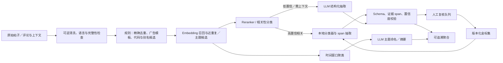

# 中文金融／股票社区评论情感与语义分析：模型、数据集与落地方案

> 调研日期：2026-09-10（Asia/Hong_Kong）  
> 范围：外部模型、公开人工标注数据集、训练与评测设计。本文不重复本地代码架构或数据写入链路审计。  
> 来源原则：模型能力、上下文限制、许可和数据规模只采用论文原文、发布方模型／数据集卡、官方仓库或官方 API 文档。本文所有外部链接的访问日期均为 **2026-09-10**。

## 1. 结论先行

futu-radar 不应寻找一个“万能情感模型”直接处理所有文本。生产方案应拆成可校准、可追溯的级联管线：

1. **规则和主数据先做确定性工作**：清洗、精确去重、广告模板、股票代码／产品别名候选召回。
2. **先判目标相关性，再判态度**：`irrelevant` 不能混入 `neutral`；“恒指会跌”属于市场方向，“这只 ETF 跟踪差”才是产品态度。
3. **小型判别模型承担全量闭集任务**：相关性、三分类产品态度、意图、情绪和风险信号分别输出类别概率；P0 同场比较 MacBERT 与 Mengzi-BERT-base-fin。
4. **embedding 与 reranker 处理语义召回**：用于标的消歧、近重复、主题聚类和证据检索，不把相似度当作情感极性。
5. **LLM 只处理复杂和低频任务**：冷启动弱标注、跨句抽取、难例裁决、主题命名和有证据的摘要。LLM 输出必须经过枚举／JSON Schema 校验，不能把模型自报的置信度当作已校准概率。
6. **自有富途语料金标集是最终选型依据**：公开集与本项目的“ETF 产品态度”标签不完全同构，而且大多数最相关中文金融数据缺少商业许可或明确限制非商业使用。

建议的首轮候选组合是：

| 管线位置 | P0 首选 | 对照候选 | 选择原则 |
|---|---|---|---|
| 目标相关性／三分类态度 | `MacBERT-base`、`Mengzi-BERT-base-fin` 分别微调 | Chinese RoBERTa、中文 FinBERT；已有可靠金标仍不够时再试更大分类器 | 同一金标、同一切分、同一阈值比较 macro-F1、校准与吞吐 |
| 召回／近重复／聚类 | `BGE-M3` | `Qwen3-Embedding-0.6B` | 中文及繁简／港式表达上的 recall、聚类稳定性与资源占用 |
| 相关性重排 | `bge-reranker-v2-m3` 只重排 Top-K | `Qwen3-Reranker-0.6B` | reranker 是逐对计算，不能无筛选跑全部标的 × 全部评论 |
| 本地教师／复杂抽取 | `Qwen3.5-4B` 文本输入、非思考模式 | 更大的本地模型只作质量上限 | 固定快照、温度、提示词、输出 schema，并在金标集上盲测 |
| 托管教师／难例 | 当前 API 名 `deepseek-flash` | 其他供应商须另行做同集评测和数据治理审查 | 仅在数据出境、保留政策和服务条款获批后使用；按 token 与失败重试实测成本 |

这不是先验认定某个候选最好。最终生产模型必须由项目自有金标集、时间外测试集、未见标的测试集及真实吞吐压测共同决定。

## 2. 项目内真正需要分析的对象

项目口径已明确：产品态度只判断费用、流动性、跟踪表现、机制、分红和使用体验等产品属性；单纯预测指数或价格涨跌属于产品话题情绪，不计入产品正负态度。重点舆情也只能输出“信号＋命中依据＋待人工确认”，不能判断真伪、违法或违规。参见 [PRD §3.4](../PRD.md#34-产品态度分类)、[PRD §3.7](../PRD.md#37-ai-边界与可追溯) 与 [ADR-0010](../adr/0010-annotations-and-ai-pipeline.md)。

账号域还存在一个重要数据边界：[PRD §3.8](../PRD.md#38-账号域统一口径) 记录了评论区逐条内容不完整，因此当前 KOL 与官号页面应分析**帖子正文**；市场／产品域只有在评论文本确实可得时才运行评论级分析。模型不能补造缺失评论。

### 2.1 任务拆解与适用技术

| 子任务 | 建议标签／输出 | 首选方法 | 使用区域与理由 |
|---|---|---|---|
| 文本有效性与语言 | `valid / empty / no_text / corrupted`，简体／繁体／粤语表达／中英混合 | 规则＋轻量分类器 | 所有页面的入口质量门；保留原文，繁简转换只作为附加视图 |
| 垃圾、广告与重复 | exact hash、模板 ID、`spam / normal`、近重复簇 | 规则、MinHash／SimHash、embedding | 全局去重、避免单一文案放大情绪与主题；语义近重复只降权，不直接删除 |
| 标的实体与代码映射 | 提及 span、候选 `product_id`、`resolved / ambiguous / NIL` | 主数据词典＋正则＋序列标注＋embedding 召回＋reranker | 所有产品聚合的前置条件；代码、简称、发行商、指数名和代词可能指向不同对象 |
| 目标相关性 | `relevant / irrelevant / needs_context` | 三分类 encoder；低置信交 LLM | 市场／产品评论的第一道门；防止把市场涨跌、其他股票或闲聊计入中性态度 |
| 产品态度三分类 | `positive / neutral / negative`；另设 `not_applicable` | encoder 分类器 | P0 核心；板块总览、产品监控、KOL 主要态度。只在 `relevant` 时输出 |
| 产品态度五分类 | `strong_negative / negative / neutral / positive / strong_positive` | 有序分类器或五分类 encoder | P2；只有金标能稳定区分强弱且每类样本足够时启用，不能由三分类概率机械切档 |
| aspect／对象级情感 | `target_id + aspect + polarity + evidence_span`；允许一条文本多目标、多 aspect | span／序列标注＋多标签分类；复杂句交 LLM | 产品监控的费用、流动性、跟踪、机制、分红、体验主题；解决“指数看多但嫌产品溢价高”的混合极性 |
| 立场识别 | 对明确命题 `favor / against / neutral_or_unclear` | target-aware classifier | KOL／帖子对事件、政策或主张的立场；不能与产品态度或市场方向混用 |
| 情绪 | `none / joy / anger / sadness / fear / surprise`，必要时多标签 | 多标签 classifier | 舆情解释和事件观察；不进入产品赞踩比分母 |
| 意图／帖子类型 | 提问、信息分享、产品评价、市场预测、交易动作、投诉、推广、其他 | 多标签 classifier；开放类由 LLM 提议后固化 | KOL 活动、官号动态、产品证据筛选；“买入”是动作意图，不自动等于产品正面 |
| 金融事件 | 事件类型、触发词、主体、客体、数值、时间、证据 span | 序列标注／span 抽取；LLM 作复杂抽取 | 官号动态、KOL 帖子和产品时间线；结构化事件便于追踪而非只留摘要 |
| 否定与反讽 | 否定词及作用域、`sarcasm yes/no/uncertain` | 规则＋span 模型；低置信交 LLM | 所有态度任务的修正信号；“真是好产品，又折价十个点”不能只按正面词判定 |
| 主题聚类 | embedding、cluster ID、代表证据、生命周期 | embedding＋时间窗口聚类；LLM 只命名／摘要 | 板块总览、产品正负观点、KOL 话题；聚类先于摘要，避免 LLM 凭空估计主题频率 |
| 摘要 | ≤业务规定字数的结论、证据 ID、覆盖样本数 | 检索／聚类后 LLM 生成＋事实校验 | 产品当前舆情、官号内容、KOL 帖子；摘要必须回链原文，不能直接生成总体比例 |
| 风险与不确定性 | 风险信号枚举、证据 span、`needs_review`、不确定原因 | 高召回 classifier＋规则＋LLM 解释＋人工确认 | 产品重点舆情；只标“命中信号”，不输出事实裁决、违法判断或自动处置 |

### 2.2 三组容易混淆、必须分别存储的标签

1. **产品态度**：针对 ETF 产品属性的评价，例如“费率低”“跟踪差”。
2. **市场方向**：对指数、板块或价格的 `bullish / bearish / flat / unclear` 预测。
3. **行为意图／立场**：例如“准备加仓”属于行为意图；“支持降费”是对命题的立场。它们可以与产品态度相关，但不能互相代替。

一条文本可同时具有多个结果，例如“恒指会涨，但这只溢价太高，先不买”应记录为：市场方向看多、产品 aspect“溢价”负面、交易意图“暂不买”。

### 2.3 页面落点

| 页面 | 应使用的模型结果 | 暂不应使用的结果 |
|---|---|---|
| 板块总览 | 产品相关评论的三分类聚合、净情绪、主题簇、重点舆情信号及证据 | 未经过相关性门控的全量“正负面”；LLM 直接估计占比 |
| 产品监控 | aspect 级正负观点、事件、主题生命周期、带证据摘要、风险信号 | 把市场涨跌预测当产品态度；无证据的风险结论 |
| KOL 活动／详情 | 当前可得帖子正文的类型、市场方向、实体、立场、主题和摘要 | 在评论正文不完整时输出评论区情绪、评论摘录或评论者画像 |
| 官号动态 | 帖子类型、金融事件、实体、摘要、原文证据 | 将官号发布语气直接解释为投资建议或市场预测 |

## 3. 模型与组件核查

### 3.1 中文 encoder、ERNIE 与 FinBERT 类

| 候选 | 可核实事实 | 许可与商用判断 | 适配判断 | 部署成本边界 |
|---|---|---|---|---|
| Chinese RoBERTa-wwm-ext | 12 层、hidden 768、最大位置 512；发布的是 MLM backbone，不是情感分类器。[模型卡](https://huggingface.co/hfl/chinese-roberta-wwm-ext)／[配置](https://huggingface.co/hfl/chinese-roberta-wwm-ext/blob/main/config.json)（访问 2026-09-10） | Apache-2.0；权重可作为商业微调候选，需保留许可声明 | 通用中文基线；必须增加项目分类头并用富途金标训练 | 约 BERT-base 级，适合批处理和 CPU／单卡基线；真实吞吐需实测 |
| MacBERT-base | 12 层、hidden 768、最大位置 512，通用中文 MLM。[模型卡](https://huggingface.co/hfl/chinese-macbert-base)／[官方仓库](https://github.com/ymcui/MacBERT)（访问 2026-09-10） | Apache-2.0；可作为商业微调候选 | 适合做透明、低成本对照；没有金融社区标签知识 | 同为 BERT-base 级；P0 可快速训练两个独立分类头 |
| Mengzi-BERT-base-fin | 在 Mengzi-BERT-base 上继续使用 20GB 财经新闻和研报训练，任务含 MLM、POS、SOP；最大位置 512。[模型卡](https://huggingface.co/Langboat/mengzi-bert-base-fin)／[论文](https://arxiv.org/abs/2110.06696)（访问 2026-09-10） | Apache-2.0；权重许可允许商业候选 | 金融词汇适配强于通用模型的可能性较高，但新闻／研报与社区短评仍有域差；应与 MacBERT 同集 A/B | BERT-base 级；推荐作为 P0 金融 encoder 主候选 |
| Erlangshen-Roberta-330M-Sentiment | 24 层、hidden 1024、最大位置 512；在 8 个中文情感集共 227,347 条上微调，但只有 `Negative / Positive` 两类。[模型卡](https://huggingface.co/IDEA-CCNL/Erlangshen-Roberta-330M-Sentiment)／[配置](https://huggingface.co/IDEA-CCNL/Erlangshen-Roberta-330M-Sentiment/blob/main/config.json)（访问 2026-09-10） | Apache-2.0；模型卡未逐项披露 8 个训练集的授权范围，商业上线仍应留存数据来源审查 | 可做开箱二分类 smoke test；不能直接提供中性、目标级或金融产品态度 | 明显高于 base encoder；不建议只为二分类承担全量成本 |
| ERNIE 3.0 base zh | ERNIE 3.0 是知识增强预训练；常用 PyTorch 卡明确说明它是官方 Paddle 权重的社区转换，配置最大位置 2,048。[论文](https://arxiv.org/abs/2107.02137)／[PaddleNLP 官方文档](https://paddlenlp.readthedocs.io/zh/latest/model_zoo/transformers/ERNIE/contents.html)／[转换模型卡](https://huggingface.co/nghuyong/ernie-3.0-base-zh)（访问 2026-09-10） | 转换模型卡未声明 license：**需法务／作者确认**；PaddleNLP 代码许可不能自动证明转换权重及训练语料许可 | 可作技术对照，不应在许可未澄清时成为生产默认 | BERT-base 级；仍需本项目分类头和金标 |
| FinBERT-tone-chinese | BERT-base、最大位置 512、三类 `Neutral / Positive / Negative`；模型卡称在约 8,000 条**私有**分析师报告句子上微调，自报测试 accuracy 0.88、macro-F1 0.87。[模型卡](https://huggingface.co/yiyanghkust/finbert-tone-chinese)／[配置](https://huggingface.co/yiyanghkust/finbert-tone-chinese/blob/main/config.json)（访问 2026-09-10） | Apache-2.0 权重；私有训练集无法审计来源、切分和标签一致性，生产使用前需模型风险审查 | 最接近开箱中文金融三分类，可作 baseline；分析师研报语气不等于社区产品态度，卡内指标不能外推 | BERT-base 级；推理便宜，但错标成本由域外误差决定 |
| 英文 FinBERT（ProsusAI／FinancialBERT） | 两者都面向英文金融文本，三类情感，最大位置 512；FinancialBERT 卡称使用 4.9B 金融 token 并以 10,000 条分析师报告句子微调。[ProsusAI 卡](https://huggingface.co/ProsusAI/finbert)／[FinancialBERT 卡](https://huggingface.co/yiyanghkust/finbert-tone)（访问 2026-09-10） | 两张 Hugging Face 卡均未声明 license：**需法务／作者确认** | 可参考领域预训练思路；不应直接用于中文、粤语或繁体评论 | 不进入 P0 生产 shortlist |

模型卡的 benchmark 不能横向当作项目排名：它们使用不同数据、标签和切分。唯一有效比较是对同一版 futu-radar 金标集做盲测。

### 3.2 embedding 与 reranker

| 候选 | 可核实事实 | 许可 | 推荐角色 | 限制与成本边界 |
|---|---|---|---|---|
| BGE-M3 | 多语、1024 维、最长 8,192 token，同时支持 dense、sparse 和 multi-vector 表示。[模型卡](https://huggingface.co/BAAI/bge-m3)／[论文](https://arxiv.org/abs/2402.03216)（访问 2026-09-10） | MIT；可商用，遵守许可 | P0 默认 embedding：别名语义召回、近重复、主题聚类、证据检索 | 约 0.6B，重于 BERT-base；聚类只需 dense 向量，没必要默认开启所有模式；它不输出情感 |
| bge-reranker-v2-m3 | 多语 cross-encoder，输入 query-document 对并输出相关性分数；官方示例以 `max_length=512` 截断。[模型卡](https://huggingface.co/BAAI/bge-reranker-v2-m3)（访问 2026-09-10） | Apache-2.0；可商用 | 用“标的及其产品属性说明”重排 embedding／词典召回的 Top-K | 每个候选对都需前向计算；只用于小候选集，不能替代全量向量召回，也不能输出情感 |
| Qwen3-Embedding-0.6B | 0.6B、100+ 语言、32K 上下文、最多 1024 维且支持可变维度和任务 instruction；官方代码示例常设 8,192。[模型卡](https://huggingface.co/Qwen/Qwen3-Embedding-0.6B)／[论文](https://arxiv.org/abs/2506.05176)（访问 2026-09-10） | Apache-2.0；可商用 | BGE-M3 的 2026 challenger，重点测试繁简、粤语夹杂和 ticker 别名 | 长上下文对短评论价值有限；instruction 和向量维度需固定后重建索引 |
| Qwen3-Reranker-0.6B | 0.6B、100+ 语言、32K 上下文、支持自定义 instruction；官方示例常设 8,192。[模型卡](https://huggingface.co/Qwen/Qwen3-Reranker-0.6B)（访问 2026-09-10） | Apache-2.0；可商用 | bge reranker 的 challenger；处理目标歧义和 hard negatives | 生成式 yes/no 打分仍是逐对计算；必须校准业务阈值 |

推荐先部署 `BGE-M3 dense + bge-reranker-v2-m3`，同时离线比较 Qwen3 0.6B 组合。只有 Qwen 在本项目切分上显著改善召回、消歧或聚类稳定性，才承担迁移索引与额外推理成本。

### 3.3 用于结构化抽取、弱标注和摘要的 LLM

| 候选 | 可核实事实 | 许可／服务边界 | 推荐角色 | 不能直接假设 |
|---|---|---|---|---|
| Qwen3.5-4B | 4B、Apache-2.0、支持 201 种语言／方言，原生上下文 262,144；模型卡列出 Transformers、vLLM、SGLang 等部署方式。[官方模型卡](https://huggingface.co/Qwen/Qwen3.5-4B)／[配置](https://huggingface.co/Qwen/Qwen3.5-4B/blob/main/config.json)（访问 2026-09-10） | 权重可商用；本地处理可控制数据边界。仍需审查容器、量化件和依赖许可 | 本地教师、低置信难例、事件／aspect 抽取、主题命名和摘要；短评论使用非思考模式 | 长上下文和通用 benchmark 不保证金融社区标签正确；4B 生成成本显著高于 100M 级 encoder；JSON 语法正确不代表语义正确 |
| DeepSeek API `deepseek-flash` | 截至调查日，官方把该别名映射到 DeepSeek-V4.1-Flash，列出 1M 上下文、JSON Output 和 tool calls；官方同时宣布 `deepseek-v4-pro` 将于 2026-09-14 路由到 Flash。[模型与版本文档](https://api-docs.deepseek.com/quick_start/pricing/)（访问 2026-09-10） | 托管 API 受实时服务条款、地域和数据处理政策约束，不是开源权重许可；上线前须完成数据治理审查 | 云端教师、抽样复核和峰值兜底；使用固定模型别名、请求日志和回放集 | 官方 JSON 模式保证合法 JSON 字符串，但文档提示可能偶发空内容；仍要做 schema、枚举、证据 span 和重试校验。[JSON Output 文档](https://api-docs.deepseek.com/guides/json_mode/)（访问 2026-09-10） |

LLM 选择时不在文档中写死每百万 token 价格。价格、缓存、并发和别名会变；上线前用真实短评论、父帖上下文、重试率和批量大小测出“每千条有效标注成本”和端到端延迟，再决定本地与 API 的分界。

## 4. 可获得的人工标注数据集

### 4.1 数据集核查表

| 数据集 | 标签、规模与标注 | 许可／访问 | 对本项目的用途与结论 |
|---|---|---|---|
| **CFLUE** | 应用评测共 16,522 条。与本项目最接近的是 500 条中文股票评论：5 位分析师标注评论对象及正／中／负情感；另有 ESG 分类与 ESG 情感各 180 条、金融事件分类 1,000 条等。论文称共 47 位有金融背景的标注者，并由资深分析师复核。[论文](https://arxiv.org/abs/2405.10542)／[官方仓库](https://github.com/aliyun/cflue)／[ModelScope 数据卡](https://www.modelscope.cn/datasets/tongyi_dianjin/CFLUE)（访问 2026-09-10） | 数据集明确为 **CC BY-NC-SA 4.0**，禁止商业使用；代码与数据不能混看。商业项目训练或内部评测均应先取得许可 | 很适合验证“多对象＋三分类＋span”的任务设计，但**不能直接用于商业训练**；若无额外授权，仅用论文设计标签和评测协议 |
| **FinChina-SA** | 论文报告 11,036 篇中文财经新闻、8,739 家公司、21,272 个实体情感样本、190 类预警；20 位金融背景标注者，每篇至少 5 人独立审核，分歧由额外标注者讨论裁决。发布标签为 `-3…2`，负面有三级强度。[论文](https://arxiv.org/abs/2306.14096)／[官方仓库](https://github.com/YerayL/FinChina-SA)／[发布 ZIP](https://raw.githubusercontent.com/YerayL/FinChina-SA/main/FinChina%20SA.zip)（访问 2026-09-10） | 仓库为 Apache-2.0，但论文只说从主要财经新闻网站抓取，未说明原文权利及 Apache 是否覆盖数据内容：**需法务／作者确认** | 可研究实体级负面强度和预警 taxonomy；新闻与社区短评域差较大。按发布 JSON 复核得到 21,273 个实体标签，比论文多 1 条；分布为 `-3:225, -2:1886, -1:12170, 0:6983, 1:8, 2:1`，极度偏负／非正，不能直接当平衡五分类训练集 |
| **BBT-CFLEB：FinFE／FinNSP** | FinFE 是股吧、雪球等中文金融社媒三分类情感，论文列 8,000／1,000／1,000；FinNSP 是负面消息及其主体识别，列 4,800／600／600。[论文](https://arxiv.org/abs/2302.09432)／[官方仓库](https://github.com/supersymmetry-technologies/BBT-FinCUGE-Applications)（访问 2026-09-10） | 仓库未声明 license，论文未充分说明 FinFE 的人工标注流程：**需法务／作者确认** | 领域与文体很相关，但不能先当商业金标。当前仓库 FinFE 文件实计 train 16,157、eval 2,020、无标签 problem 2,020，与论文规模不一致；使用前需作者确认版本、去重、划分和标签来源。[当前 FinFE 文件](https://github.com/supersymmetry-technologies/BBT-FinCUGE-Applications/tree/main/FinCUGE_Publish/finfe)（访问 2026-09-10） |
| **ASAP** | 46,730 条真实中文点评评论，18 个 aspect，人工标注 `positive / neutral / negative / not-mentioned`，另有 1–5 星；划分 36,850／4,940／4,940。[论文](https://aclanthology.org/2021.naacl-main.167/)／[官方仓库](https://github.com/Meituan-Dianping/asap)（访问 2026-09-10） | 仓库明确 Apache-2.0；按许可可作为商业训练候选，但用户评论来源、隐私和再分发仍需数据合规复核 | 非金融，适合预研 aspect-category sentiment 的数据结构和多任务训练；不能替代富途金融金标 |
| **C-STANCE** | 48,126 个中文微博—目标对、约 40,000 个不同目标，支持一条文本多目标；标签为 `favor / against / neutral`，含 target 与 domain 零样本划分。[论文](https://aclanthology.org/2023.acl-long.747/)／[官方仓库](https://github.com/chenyez/C-STANCE)（访问 2026-09-10） | 官方仓库未声明 license：**需法务／作者确认** | 适合设计 target-aware 立场任务和未见目标测试；非金融且不能在授权前用于商业训练 |
| **SMP2020-EWECT** | 中文微博六分类情绪：无情绪、积极、愤怒、悲伤、恐惧、惊奇。通用集 27,768／2,000／5,000，疫情集 8,606／2,000／3,000；官方称由哈工大提供标注、微热点提供原始数据。[官方评测页](https://smp2020ewect.github.io/)（访问 2026-09-10） | 官方数据页没有明确数据商业许可；页面仓库的主题许可不能替代微博数据授权：**需法务／作者确认** | 可研究中文社媒情绪，但不是产品态度；若获授权，只作情绪辅助任务或迁移预训练 |
| **NTU Irony Corpus** | 超过 1,000 条繁体中文 Plurk 反讽消息，全部已确认为反讽，并标注反讽词／短语、上下文及修辞元素和相关极性。[官方仓库](https://github.com/ntunlplab/NTU-Irony-Corpus)（访问 2026-09-10） | 仓库未声明 license：**需法务／作者确认** | 可用于繁体反讽 span 和规则设计；由于只有反讽正例，不能单独训练二分类反讽检测器 |
| **Financial PhraseBank** | 4,840 条英文金融新闻句子，`negative / neutral / positive`；16 位具金融背景的标注者，每句有 5–8 个标注，并提供不同一致率子集。[数据集卡](https://huggingface.co/datasets/takala/financial_phrasebank)（访问 2026-09-10） | **CC BY-NC-SA 3.0**；数据卡明确商业使用需联系作者另取许可 | 可用于英文金融基线和标注一致性方法参考；非中文、非社区、不可直接用于商业训练 |

### 4.2 公开数据的实际结论

- **可直接进入商业候选池的，是许可明确的模型权重，不是多数金融评论数据。** 模型 Apache／MIT 许可也不自动授予训练语料或下游抓取文本的权利。
- ASAP 的仓库许可最清晰，但领域不匹配；仍需检查用户生成内容的使用边界。
- CFLUE 的 500 条股票评论最贴近对象级情感，但明确非商业。
- FinFE 最贴近中文股票社区文体，但缺少数据许可、标注说明且发布规模与论文不一致。
- FinChina-SA 标注流程最扎实，但文本是新闻、类别极不平衡，且原新闻权利未说明。
- 因此，公开数据应先用于标签设计、非生产研究和迁移实验；生产模型的主金标必须来自依法取得的项目内评论／帖子。

### 4.3 可用于无监督领域适配的语料也要审权

BBT-FinCorpus 论文称其金融社媒部分来自股吧和雪球、清洗后约 120GB，仓库要求邮件申请 base／large 版本，但仓库没有数据 license，原始网页内容权利也未说明。[论文](https://arxiv.org/abs/2302.09432)／[官方仓库说明](https://github.com/supersymmetry-technologies/BBT-FinCUGE-Applications)（访问 2026-09-10）。因此不能因为它是“开放申请”就当作可商用预训练语料；使用前同样是 **需法务／作者确认**。

## 5. 推荐分层架构



### 5.1 各层职责

**规则层**处理确定性信号：空文本、HTML／URL、纯表情、精确重复、常见广告模板、HK 股票代码、产品正式名、简称、发行商和指数别名。规则命中要保留 `rule_id`，便于审计和回归。

**轻量 NLP 层**承担高频闭集任务：目标相关性、三分类产品态度、帖子意图、情绪、风险信号。可以共享 encoder，但各任务保留独立 head、阈值和校准；若多任务训练造成稀有类下降，就拆成独立模型。

**embedding／reranker 层**承担语义匹配：从 120 只产品及别名中召回候选、识别语义近重复、构建主题簇、检索摘要证据。先向量召回，再只对 Top-K 运行 cross-encoder reranker。

**LLM 层**承担开放或组合任务：多目标 aspect 抽取、事件及论元、反讽疑难、弱标注、主题命名和摘要。LLM 不直接产生情绪比例，不直接覆盖高置信分类器结果，也不把自由文本理由当事实。

**人工层**处理高影响、低置信、模型分歧、稀有类别、新标的和新话题；复核结果进入版本化金标集，再用于下一轮训练。

### 5.2 建议的统一标注记录

每个分析对象至少保存：

```json
{
  "source_id": "post_or_comment_id",
  "context_ids": ["parent_post_id", "parent_comment_id"],
  "target_ids": ["product_id"],
  "relevance": "relevant|irrelevant|needs_context",
  "product_sentiment_3": "positive|neutral|negative|not_applicable",
  "product_sentiment_5": "disabled_or_enum",
  "aspects": [{"target_id": "...", "aspect": "liquidity", "polarity": "negative", "evidence_span": [12, 24]}],
  "market_direction": "bullish|bearish|flat|unclear",
  "stance": [{"target": "claim", "label": "favor|against|neutral_or_unclear"}],
  "emotions": ["fear"],
  "intents": ["trade_action"],
  "events": [],
  "risk_signals": [{"type": "unverified_allegation", "evidence_span": [31, 52]}],
  "sarcasm": "yes|no|uncertain",
  "uncertainty_reasons": ["ambiguous_target"],
  "model_version": "immutable_snapshot",
  "prompt_version": "nullable",
  "label_schema_version": "v1",
  "confidence": 0.0,
  "human_status": "unreviewed|confirmed|corrected"
}
```

`confidence` 对判别模型应是校准后的概率；对 LLM 不采用自报分数，可改用模型一致性、证据完整性、schema 是否通过以及人工复核状态来决定是否展示。

## 6. 冷启动、训练和人工标注方案

### 6.1 冷启动顺序

1. **先冻结标签定义和决策顺序**：先目标、后相关性、再 product aspect、最后极性；另存市场方向、立场、意图和情绪。
2. **从项目内真实文本分层抽样**：覆盖产品／同业、时间、简繁／粤语夹杂、短回复、长帖、表情、不同互动量、KOL／普通用户、疑似广告、不同产品结构与罕见风险信号。
3. **先做透明基线**：多数类、关键词／规则、MacBERT、Mengzi、中文 FinBERT 零样本或直接推理。公开数据只作为附加预训练或对照，不与最终测试集混合。
4. **建立 LLM 教师基线**：同一 schema、固定少量示例、固定模型快照；输出标签、证据 span 和不确定原因。人工只采纳复核后的标签为金标。
5. **训练学生模型并校准**：相关性、产品态度和风险信号各自优化；使用温度缩放或等距回归在独立校准集上拟合概率。温度缩放的经典实证来源见 [Guo et al., ICML 2017](https://proceedings.mlr.press/v70/guo17a.html)（访问 2026-09-10）。
6. **按学习曲线扩样**：每轮只在新增标注确实提高时间外／标的外表现时继续扩大；不先拍脑袋规定最终样本量。

### 6.2 主动学习与弱监督

主动学习队列按四类混合采样，避免只挑模型最不确定的噪声：

- **不确定性**：最高概率低、top-2 margin 小、校准后高熵；
- **分歧**：MacBERT 与 Mengzi、学生与 LLM、不同提示词版本结果不一致；
- **多样性**：从 embedding 簇中选代表样本和离群点，覆盖长尾说法；
- **业务风险**：重点舆情、罕见负面 aspect、新产品、新别名和新事件优先。

弱监督可使用规则、词典、页面挂载标的、相邻上下文和 LLM 教师生成候选标签，但必须记录 `label_source`。教师标签与人工金标分开存储；只在高一致、高证据完整的样本上训练学生，并用纯人工测试集评估。弱标签不能回流污染测试集。

蒸馏顺序建议为：强 LLM 产生结构化候选 → 人工复核代表性与高风险样本 → 训练小型 encoder 学生 → 用学生覆盖高置信全量 → 低置信仍回 LLM／人工。不要从 LLM 自报置信度直接筛“高质量”标签。

### 6.3 人工标注指南的最低内容

- 明确标注对象和上下文：当前评论、父评论、帖子正文、挂载标的、时间；上下文缺失时选择 `needs_context`。
- 先圈实体／aspect 和证据 span，再选标签；一条文本多目标时逐目标标注。
- 明确产品态度与价格方向的边界，并提供正例、反例、比较句、条件句、转述、疑问、双重否定、反讽和表情案例。
- `neutral` 表示与产品相关但无正负评价；无关文本必须是 `not_applicable`，不能用中性兜底。
- 五分类强弱要用可观察的语言标准，而非标注者主观投资观点；分界不稳定时退回三分类。
- 风险标签只判断文本是否出现规定信号，并圈出命中依据；不判断指控真假、违法性或处置等级。
- 对未知新类保留 `other`／`NIL` 与备注，定期评审 taxonomy，不能强塞最接近类别。

### 6.4 标注质量控制

- 标注员先通过培训集和盲测；正式样本双人独立标注，高风险与新标签强制裁决。
- 每轮混入已裁决的隐藏检查样本；监控个人与整体混淆矩阵，而不只看总体一致率。
- 名义分类报告 Cohen's kappa 或 Krippendorff's alpha；五级有序标签同时报告加权一致性。低一致先修指南，不急于加模型。
- 裁决人只看原文和匿名初标，记录修改原因；指南版本和 schema 版本随样本保存。
- 训练、校准和测试文件按内容哈希去重；转帖、引用、同一 thread 和语义近重复必须留在同一 split。

## 7. 评测设计

### 7.1 必须保留的两套外推测试

**时间外测试**：训练使用较早时间，验证使用中间窗口，测试使用更新窗口；再做滚动回测。这样能暴露新梗、新事件、监管词和产品状态变化。

**标的外测试**：按产品／指数／发行商或产品族分组留出，测试未见标的和别名。若同一指数的多只 ETF 横跨训练和测试，应另设更严格的指数族留出，防止只记住名称。

另外，父帖与评论、同一作者的模板文案、转帖及近重复簇不能跨 split。公开数据只用于预训练／辅助实验，最终测试必须是独立的项目内人工金标。

### 7.2 指标

| 任务 | 主指标 | 必看切片／辅助指标 |
|---|---|---|
| 相关性 | macro-F1；`relevant` recall | `needs_context`、短回复、无显式代码、繁体／粤语、未见标的；precision-recall 曲线 |
| 三／五分类态度 | macro-F1、每类 precision／recall、混淆矩阵 | 负面召回、neutral 误吞、产品 aspect、强弱两端；五分类另看有序距离误差 |
| aspect／实体／事件 span | exact 与 relaxed span F1 | target linking accuracy、NIL recall、事件论元 F1；端到端指标要把目标映射错误计入 |
| 立场／情绪／意图／风险 | macro-F1；多标签 micro／macro-F1 | 稀有类 PR-AUC、风险信号 recall 与人工确认 precision |
| 去重／聚类 | pairwise F1 或 B-cubed；簇稳定性 | 人工主题一致性、跨时间簇延续、离群比例；不能只报 silhouette |
| 摘要 | 人工事实一致性、证据覆盖、遗漏率 | 每句话能否定位证据、数字／标的／时间是否一致、相反观点是否被抹去 |
| 校准与拒答 | Brier score、ECE、risk-coverage curve | 各类别和各切片可靠性图；比较固定覆盖率下错误率 |
| 系统 | p50／p95 延迟、吞吐、峰值内存、失败／重试率 | 每千条有效结果的实测资源成本、缓存命中率、LLM 升级率 |

不预设脱离数据的单一“上线 F1”。P0 标注完成后，由业务定义不同错误的代价，再确定展示阈值、人工队列容量和可接受 coverage。重点舆情应优先保证召回，并通过人工确认控制误报；公开展示的态度聚合则更重视校准和稳定性。

### 7.3 漂移监测

至少按周／版本监控：

- 输入长度、语言／繁简比例、emoji／URL、未知字符和空文本率；
- 产品、发行商、aspect、类别先验和新别名的变化；
- embedding 分布、主题簇新增／消失、近重复率；
- 模型置信度、拒答率、LLM 升级率、人工纠错率；
- 在滚动人工审计样本上的 macro-F1、负面召回、校准和各切片表现。

触发重训应以金标性能下降、校准恶化或新业务 taxonomy 为依据，不能只凭 embedding 距离变化自动重训。

## 8. 在线与离线成本边界

| 路径 | 适合放置的工作 | 成本控制 |
|---|---|---|
| 同步在线 | 可逆清洗、代码／别名规则、exact hash、已部署的小型相关性和态度 classifier | 固定最大 token；批处理；按文本 hash＋target＋模型版本缓存；超时返回明确 `pending/unavailable` |
| 异步近实时 | embedding、近重复、Top-K rerank、事件／aspect 抽取、风险信号 | 只处理新增或内容变更记录；reranker 限定候选数；低置信进入队列 |
| 小时／日批 | 主题聚类、生命周期、证据选择、摘要、校准统计 | 按时间窗增量更新；摘要只输入代表证据与反例，不输入全量重复文本 |
| 离线 | 全历史回填、主动学习、教师标注、训练、阈值与校准、漂移回测 | 使用不可变数据快照和模型 revision；记录硬件、batch、token、失败重试，比较单位有效输出成本 |

生成式模型调用要以 `normalized_text_hash + context_hash + target_id + schema_version + prompt_version + model_snapshot` 作为缓存键。任何 schema、目标或上下文变化都应重新计算，避免误复用旧标签。

## 9. P0／P1／P2 实施路线

### P0：先让核心指标可信

- 冻结 `relevance`、产品态度三分类、`needs_context`、证据 span 和标的映射规范。
- 建立项目内分层金标、双标与裁决流程；单独保留时间外和标的外测试。
- 实现规则／主数据候选召回、exact 与近重复去重。
- 同集比较 MacBERT、Mengzi 和中文 FinBERT baseline；选择 macro-F1、校准、吞吐共同最优者。
- 部署 BGE-M3 做语义召回／聚类，bge reranker 仅处理消歧候选。
- LLM 只做教师和低置信样本；所有输出保存证据、模型／提示词／schema 版本。
- 先支撑板块总览与产品监控的三分类、主题证据和摘要；低样本／未完成状态如实展示。

### P1：补全对象级语义和运营闭环

- 增加 aspect 情感、市场方向、立场、意图和金融事件抽取；KOL／官号仅分析当前可得帖子正文。
- 建立主动学习队列、人工复核台账、温度校准、risk-coverage 和漂移看板。
- 对 BGE 与 Qwen3 embedding／reranker 做同集替换实验；只有显著改善才迁移索引。
- 对重点舆情做高召回 signal classifier，LLM 生成命中解释，人工确认后展示。
- 以聚类代表证据生成摘要，加入数字、实体、时间和反向观点一致性检查。

### P2：在数据证明需要时提高粒度

- 只有标注一致性与每类样本支持时，启用五级有序态度；否则维持三分类。
- 增加反讽／否定 scope、跨句共指、粤语与中英混合专项模型或数据增强。
- 用已复核 LLM 标签蒸馏更小学生模型，逐步降低 LLM 升级率。
- 做主题簇跨时间匹配、新增／持续／消退判定和事件—观点关联。
- 在合规批准后评估领域继续预训练或 LoRA；未获授权的公开语料不得进入商业训练。

## 10. 最终选型矩阵

评分是对本项目角色的定性判断，不是通用模型排行。

| 候选 | 中文社区适配 | 金融适配 | 目标任务适配 | 许可清晰度 | 相对运行成本 | 建议 |
|---|---|---|---|---|---|---|
| MacBERT-base | 中 | 低 | 微调后适合闭集分类 | 高 | 低 | P0 通用基线；已有同版金标失败证据时停止追加投入 |
| Mengzi-BERT-base-fin | 中 | 中高（新闻／研报） | 微调后适合闭集分类 | 高 | 低 | **P0 主候选** |
| Chinese RoBERTa-wwm-ext | 中 | 低 | 微调后适合闭集分类 | 高 | 低 | 回归基线 |
| 中文 FinBERT-tone | 低至中 | 中（研报） | 开箱三分类但口径不一致 | 中 | 低 | smoke test，不直接上线 |
| Erlangshen 330M Sentiment | 中 | 低 | 仅正／负二类 | 中 | 中 | 二分类下限，不进入主线 |
| ERNIE 3.0 转换权重 | 中 | 低 | 需微调 | 低 | 低至中 | 许可澄清前搁置 |
| BGE-M3 | 中高 | 需项目适配 | 召回、去重、聚类强匹配 | 高 | 中 | **P0 embedding 首选** |
| bge-reranker-v2-m3 | 中高 | 需项目适配 | 相关性／消歧强匹配 | 高 | 中高（逐对） | **P0 Top-K rerank 首选** |
| Qwen3 Embedding／Reranker 0.6B | 中高 | 需项目适配 | 召回／重排强匹配 | 高 | 中高 | P1 challenger |
| Qwen3.5-4B | 高潜力 | 需提示和金标 | 复杂抽取、教师、摘要 | 高 | 高于 encoder | **本地教师／难例** |
| DeepSeek `deepseek-flash` API | 高潜力 | 需提示和金标 | 复杂抽取、教师、摘要 | 服务条款制 | 按 token、重试与并发变化 | 数据治理批准后的云端对照／兜底 |

## 11. 尚不能确认、上线前必须关闭的事项

1. **数据许可**：FinFE／FinNSP、C-STANCE、SMP2020-EWECT、NTU Irony Corpus 均没有可确认的商业数据许可；FinChina-SA 的 Apache 仓库许可是否覆盖抓取新闻正文也不明确。统一标记为 **需法务／作者确认**。
2. **CFLUE 与 Financial PhraseBank**：明确为 NonCommercial，不能写成可直接用于商业训练；如要使用，需另取授权。
3. **社区文本来源权利**：无论公开集还是项目内数据，抓取许可、平台条款、个人信息、保留周期、跨境传输和模型供应商数据处理政策都需单独审查。
4. **社区域效果**：Mengzi 与中文 FinBERT 的训练语体是新闻／研报，模型卡没有富途、港股、粤语、繁体、ETF 产品态度结果；只能由项目金标验证。
5. **模型训练数据透明度**：Erlangshen 卡未逐项披露 8 个情感数据集的许可；中文 FinBERT 使用私有语料，无法复核来源和标签质量；ERNIE 社区转换卡未声明 license。
6. **硬件和吞吐**：现有材料不足以给出 futu-radar 的准确部署成本。需要拿真实长度分布、候选标的数、每小时增量、峰值并发和 LLM 升级率压测后确定。
7. **托管模型稳定性**：DeepSeek 官方已经公告 2026-09-14 的别名路由变化。所有托管模型必须固定可回放请求、监控版本变化，并在变更后重跑回归集。
8. **五分类可行性**：公开金融数据中的强弱标签分布严重失衡，项目标注员能否稳定区分五级尚未验证；P0 不应承诺五级结果。

## 12. 主要一手来源索引

以下来源均访问于 2026-09-10：

- 中文 backbone：[Chinese-BERT-wwm 官方仓库](https://github.com/ymcui/Chinese-BERT-wwm)、[MacBERT 官方仓库](https://github.com/ymcui/MacBERT)、[Mengzi 论文](https://arxiv.org/abs/2110.06696)、[ERNIE 3.0 论文](https://arxiv.org/abs/2107.02137)。
- 金融／情感模型：[Mengzi-BERT-base-fin 模型卡](https://huggingface.co/Langboat/mengzi-bert-base-fin)、[中文 FinBERT 模型卡](https://huggingface.co/yiyanghkust/finbert-tone-chinese)、[Erlangshen 情感模型卡](https://huggingface.co/IDEA-CCNL/Erlangshen-Roberta-330M-Sentiment)。
- embedding／reranker：[BGE-M3 模型卡](https://huggingface.co/BAAI/bge-m3)、[BGE reranker 模型卡](https://huggingface.co/BAAI/bge-reranker-v2-m3)、[Qwen3 Embedding 模型卡](https://huggingface.co/Qwen/Qwen3-Embedding-0.6B)、[Qwen3 Reranker 模型卡](https://huggingface.co/Qwen/Qwen3-Reranker-0.6B)。
- LLM／API：[Qwen3.5-4B 模型卡](https://huggingface.co/Qwen/Qwen3.5-4B)、[DeepSeek 模型与版本](https://api-docs.deepseek.com/quick_start/pricing/)、[DeepSeek JSON Output](https://api-docs.deepseek.com/guides/json_mode/)。
- 中文金融数据：[FinChina-SA 论文](https://arxiv.org/abs/2306.14096)与[仓库](https://github.com/YerayL/FinChina-SA)、[BBT-CFLEB 论文](https://arxiv.org/abs/2302.09432)与[仓库](https://github.com/supersymmetry-technologies/BBT-FinCUGE-Applications)、[CFLUE 论文](https://arxiv.org/abs/2405.10542)与[官方数据卡](https://www.modelscope.cn/datasets/tongyi_dianjin/CFLUE)。
- 中文社媒／对象级数据：[ASAP 论文](https://aclanthology.org/2021.naacl-main.167/)与[仓库](https://github.com/Meituan-Dianping/asap)、[C-STANCE 论文](https://aclanthology.org/2023.acl-long.747/)与[仓库](https://github.com/chenyez/C-STANCE)、[SMP2020-EWECT 官方页](https://smp2020ewect.github.io/)、[NTU Irony Corpus 官方仓库](https://github.com/ntunlplab/NTU-Irony-Corpus)。
- 英文金融对照：[Financial PhraseBank 数据集卡](https://huggingface.co/datasets/takala/financial_phrasebank)。
